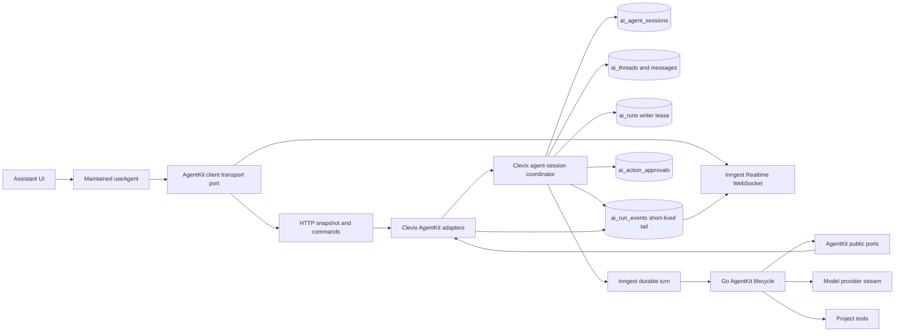
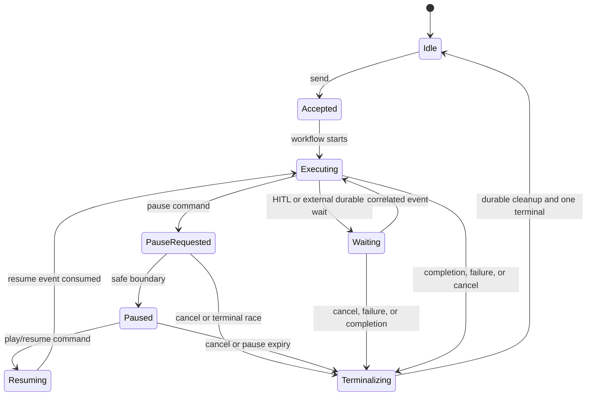

# Stateful editor agent runtime and assistant reliability

| Field            | Value                                                                                                    |
| ---------------- | -------------------------------------------------------------------------------------------------------- |
| Status           | active — implementation in progress                                                                      |
| Created          | 2026-08-22                                                                                               |
| Updated          | 2026-08-22                                                                                               |
| Author           | Codex, with Clevix engineering                                                                           |
| Reviewers        | Web chat owner, Clevix Server owner, AgentKit/use-agent owner, Inngest workflow owner, Security, Billing |
| Priority         | p1-high                                                                                                  |
| Estimated Effort | xl                                                                                                       |

## Summary

Refactor the editor assistant into one server-authoritative, project-bound agent
runtime with a private per-user conversation session, durable snapshot-plus-tail
recovery, true provider streaming, synchronized tabs/devices, and user-visible
Pause/Play controls. The implementation keeps React `@inngest/use-agent`, Clevix
Server's Go AgentKit runtime, Inngest, the existing tenant databases, and Inngest
Realtime; Cloudflare Agents is a behavioral reference only, not a second runtime.

## Problem Statement

The AgentKit-first frontend refactor established part of the correct ownership
boundary: `@inngest/use-agent` owns standard AgentKit event reduction and the
React transcript, while Clevix owns application policy and implements AgentKit's
persistence and transport contracts. The remaining architecture must follow the
same adapter pattern as AgentKit's documented history support: AgentKit defines
public lifecycle interfaces, invokes them at the correct lifecycle points, and
remains storage-agnostic; Clevix Server supplies implementations backed by its
repositories, tenant database, Inngest, billing, authorization, and project
policies. The current stack is usable, but it still has reliability and
maintenance gaps that become visible during long turns, refreshes, multiple
tabs, Realtime failures, package upgrades, and human approval.

The current runtime versions are:

- frontend: `@inngest/use-agent` **0.4.0**, pinned in
  [`apps/web/package.json`](https://github.com/eadwinCode/landing-page-builder/blob/main/apps/web/package.json) and modified by the root Bun
  patch [`patches/@inngest%2Fuse-agent@0.4.0.patch`](https://github.com/eadwinCode/landing-page-builder/blob/main/patches/%40inngest%252Fuse-agent%400.4.0.patch);
- editor server: `github.com/eadwinCode/agent-kit/go`
  **v0.1.0-alpha.1**, pinned in
  [`apps/clevix-server/go.mod`](https://github.com/eadwinCode/landing-page-builder/blob/main/apps/clevix-server/go.mod);
- legacy Node packages: the root TypeScript `@inngest/agent-kit` fork remains
  pinned for non-editor/legacy packages. It is **not** the Go runtime executing
  editor assistant turns and must not be mistaken for it.

The current browser composition hook in
[`use-project-agent-chat.ts`](https://github.com/eadwinCode/landing-page-builder/blob/main/apps/web/src/components/builder/ai-chat-v3/use-project-agent-chat.ts)
contains necessary recovery and action orchestration around the hook: terminal
history refresh, five-second active-run polling, pending-HITL recovery,
cancel/truncate/resend, local command-pending flags, and refs that stabilize
package actions. The HTTP adapter in
[`agent-v3-transport.ts`](https://github.com/eadwinCode/landing-page-builder/blob/main/apps/web/src/lib/agent-v3-transport.ts) separately
retains structured `409` data and retries Realtime token acquisition indefinitely
because the stock dependency loses information or enters a terminal connection
error.

On the server, [`runtime.go`](https://github.com/eadwinCode/landing-page-builder/blob/main/apps/clevix-server/internal/usecase/aichat/runtime.go)
currently enables `StreamReasoning: true` and `SimulateChunking: true`. The latter
only animates provider-completed content after inference; it is not true
time-to-first-token streaming. [`datastream.go`](https://github.com/eadwinCode/landing-page-builder/blob/main/apps/clevix-server/internal/usecase/aichat/datastream.go)
injects Clevix data, status, and HITL parts because AgentKit does not provide
tools/the router a structured streaming context. It also suppresses AgentKit's
early `stream.ended`, because Clevix must publish the authoritative terminal only
after history, repository publication, billing, active-run cleanup, and live
writer drain. [`live_emitter.go`](https://github.com/eadwinCode/landing-page-builder/blob/main/apps/clevix-server/internal/usecase/aichat/live_emitter.go)
is bounded and safe for concurrent producers, but best-effort delivery can
coalesce, drop, or fail and therefore requires durable reconciliation.

The database already contains:

- `ai_threads`, scoped by team, project, and user, with canonical
  `ai_thread_messages` and a JSON `active_run` lease;
- `ai_runs`, which is the **project-wide Git workspace/writer lease**, not a
  complete chat-agent lifecycle record;
- `ai_run_events`, a 24-hour, short-lived standard-event replay journal for the
  current active run;
- `ai_action_approvals`, the ownership-, expiry-, decision-, and consumption-
  audited HITL record.

The public “current thread” API currently calls `GetLatestThread`, which selects
`ORDER BY ai_threads.updated_at DESC`. That is not an explicit current-thread
pointer: a background update to an older thread can change which conversation is
loaded. A browser-local pointer is also unacceptable because a new device,
cleared storage, or disconnected originating tab must not change agent identity
or recovery.

The history repository itself is not a workaround. It is the intended AgentKit
adapter boundary. The technical debt is that the current Clevix runtime manually
calls history lifecycle methods around the network run and uses an admitted
adapter variant that disables or defers parts of the standard lifecycle. AgentKit's
documented pattern is for the runtime to call `createThread`, `get`,
`appendUserMessage`, and `appendResults` automatically. The Go runtime must gain
the equivalent public contract and lifecycle ownership; Clevix should then only
implement that contract.

### Current limitations inventory

Status meanings:

- **Fixable here** — owned by this specification.
- **Imported workstream** — already tracked elsewhere; this specification adopts
  its exit criteria without declaring it complete.
- **Inherent/provider constraint** — document and design around it; software
  cannot remove it.
- **Deliberate product choice** — retain unless product explicitly changes it.

| Area                          | Current limitation                                                                                                                                                                                              | Status                                   | Required disposition                                                                                                                                                                                                  |
| ----------------------------- | --------------------------------------------------------------------------------------------------------------------------------------------------------------------------------------------------------------- | ---------------------------------------- | --------------------------------------------------------------------------------------------------------------------------------------------------------------------------------------------------------------------- |
| lifecycle adapter boundary    | Several generic capabilities are orchestrated in Clevix around AgentKit instead of being invoked by AgentKit through public contracts; this encourages raw-envelope inspection and package-private assumptions. | Fixable here                             | AgentKit defines and invokes storage/transport/control ports; Clevix implements adapters. Keep tenancy, authorization, billing, retention, current-thread policy, and Git writer leasing in Clevix.                   |
| use-agent distribution        | Clevix depends on a Bun patch over stock `@inngest/use-agent@0.4.0`; reinstall/upgrade behavior and published artifacts can diverge.                                                                            | Fixable here                             | Land changes in the maintained `agent-kit`/`use-agent` source, publish a versioned release, pin it exactly, verify the artifact, then remove the local patch.                                                         |
| use-agent reducer fidelity    | Stock 0.4.0 does not fully reduce declared reasoning, data, status, error, and HITL events and previously failed to expose stored error/current-agent state correctly.                                          | Fixable here                             | Preserve all maintained reducers and public state in the package release with executable hook tests.                                                                                                                  |
| history fidelity              | Live and history formatting can disagree on structured parts, IDs, statuses, timestamps, errors, HITL, and the current agent.                                                                                   | Fixable here                             | Define one package-owned formatter and require live-to-history equivalence tests for every supported part.                                                                                                            |
| custom connection behavior    | Clevix needs provider enforcement and an explicit/shared `IConnection`; stock provider creation and refresh semantics do not meet current recovery needs.                                                       | Fixable here                             | Make explicit connection ownership, connection diagnostics, and recoverable refresh behavior supported public package capabilities.                                                                                   |
| strict sequencing recovery    | `sequenceNumber` is required and correct, but `useAgent`'s strict contiguous buffering has no automatic recovery when one number is missing; later events can wait indefinitely.                                | Fixable here                             | AgentKit defines sequence/replay contracts and recovery semantics. Clevix implements the replay store and authorized transport over `ai_run_events`; the package requests backfill through the public transport port. |
| in-progress recovery          | S4 server persistence exists, but client replay integration is rolled back; refresh/second-tab status and parts can diverge.                                                                                    | Imported workstream (S4)                 | Complete snapshot-plus-tail through the package, not an application reducer, and prove multi-tab/reload behavior.                                                                                                     |
| optimistic user turns         | The initiating tab receives the optimistic user message; other tabs commonly converge only after terminal history refresh.                                                                                      | Fixable here                             | Publish or snapshot the accepted user turn so every authorized client sees it immediately with one stable message ID.                                                                                                 |
| originating-client dependency | A disconnected initiating tab cannot be assumed to retain missing live state or drive recovery.                                                                                                                 | Fixable here                             | Durable execution and state progress independently; any later authorized client rebuilds from server snapshot, event tail, then canonical history.                                                                    |
| lifecycle/activity conflation | Package lifecycle is coarse (`submitted`, `streaming`, `ready`, `error`) while UI needs truthful `Reading`, `Thinking`, tool, approval, pause, and finalization activity.                                       | Fixable here                             | Keep lifecycle and semantic activity orthogonal. `Thinking` requires provider-returned reasoning activity; elapsed time is never evidence of thinking.                                                                |
| structured HTTP errors        | Default transport reduces responses to `Error.message`; Clevix uses a side variable to retain structured active-run `409` data.                                                                                 | Fixable here                             | Return a typed `AgentTransportError` with status, code, recoverability, correlation ID, details, and optional authoritative snapshot.                                                                                 |
| thread actions                | Client-side UUID creation, create/rename declarations, action identity changes, retry/edit orchestration, and actual transport behavior are not consistently aligned.                                           | Fixable here                             | Server mints threads and owns the current pointer; package exposes stable actions; retry/edit/new-chat become idempotent server commands. Rename stays internal unless product restores it.                           |
| current thread                | “Current” is inferred from latest `updated_at`, so unrelated/background history writes can switch it.                                                                                                           | Fixable here                             | Add an explicit server-owned current-thread pointer with revision/CAS semantics. No localStorage authority.                                                                                                           |
| previous-thread UI            | Users cannot select/delete previous conversations from the assistant; New chat exists elsewhere.                                                                                                                | Deliberate product choice                | Keep list/fetch/delete transport only for validation/administration/recovery. Do not restore a thread picker or delete UI.                                                                                            |
| Realtime refresh              | `@inngest/realtime` 0.4.x can enter a terminal error after one token-refresh failure; the app retries inside token acquisition.                                                                                 | Fixable here                             | Package/connection layer classifies auth vs transient failures, retries transient failures with bounded jitter/backoff, and can recover without remounting.                                                           |
| D1 provider streaming         | Go AgentKit waits for complete inference and simulated chunking only creates post-completion animation.                                                                                                         | Imported workstream (D1)                 | Stream provider reasoning/text deltas before inference completion while preserving the exact final result, history, usage, tools, replay, and cancellation semantics.                                                 |
| tool-argument streaming       | Tool arguments are available only after inference completes; D1 text/reasoning alone does not make argument construction incremental.                                                                           | Fixable here, separate from D1           | Add explicit provider/tool-call argument delta support and tests; do not claim it as part of D1 unless its package contract lands.                                                                                    |
| provider reasoning            | Providers expose different reasoning summaries/content, and some expose none. Hidden chain-of-thought cannot be requested or reconstructed.                                                                     | Inherent/provider constraint             | Render only provider-exposed reasoning. Fall back to `Working` or truthful semantic tool activity. Never synthesize hidden thought.                                                                                   |
| exact model pause             | A provider request cannot be frozen mid-token and resumed from its internal model state.                                                                                                                        | Inherent/provider constraint             | Pause v1 takes effect at the next safe durable boundary. Immediate abort-and-restart is a future, lossy mode, not exact resume.                                                                                       |
| tool interruption             | External tools cannot always stop safely after a side effect begins.                                                                                                                                            | Inherent/provider constraint             | Check pause/cancel before tools and at declared checkpoints; finish an unsafe atomic side effect before pausing and expose that state.                                                                                |
| tool/router stream context    | AgentKit does not give tools/network router a typed structured emitter, so Clevix wraps raw publish and injects parts.                                                                                          | Fixable here                             | Add an AgentKit structured stream port/context for status/data/HITL/tool progress with stable IDs; Clevix tools use that public API and stop inspecting outbound envelopes.                                           |
| terminal ownership            | AgentKit emits terminal too early for Clevix billing, repository publication, cleanup, and live drain.                                                                                                          | Fixable here                             | Define terminal coordination hooks so exactly one Clevix-authoritative terminal is emitted after all durable facts settle.                                                                                            |
| Go HITL integration           | Clevix owns issue, audit, ownership, 10-minute expiry, Inngest wait, decision persistence, one-time consumption, resume, and UI reconstruction; AgentKit only supplies partial primitives.                      | Fixable here with retained Clevix policy | Add reusable Go AgentKit HITL control primitives without moving authorization/audit policy out of Clevix. HITL must work throughout migration.                                                                        |
| live loss/backpressure        | The 256-item/1 MiB emitter can coalesce/drop on saturation and live publication can fail.                                                                                                                       | Fixable here                             | Persist accepted standard envelopes before fan-out, expose `reconcileRequired`, backfill gaps, retain bounded memory, and reconcile terminal history.                                                                 |
| replay identity               | Inngest replay can restart an invocation-local sequence, while stable event/part identity must prevent duplicates.                                                                                              | Fixable here                             | Introduce explicit stream epochs and define stable run/message/part/event identity across retries/replays.                                                                                                            |
| dependency stability          | Go AgentKit is alpha and the maintained frontend package is effectively a fork; public API compatibility is not guaranteed.                                                                                     | Fixable here operationally               | Exact pins, release provenance, contract suites, changelogs, upgrade runbook, and no implicit/floating upgrades.                                                                                                      |
| legacy TypeScript boundary    | Root `@inngest/agent-kit` remains for legacy Node code and can be confused with the editor runtime.                                                                                                             | Fixable here within cleanup boundary     | Inventory consumers, name it explicitly in docs, remove only proven-dead imports, and do not block Go runtime work on unrelated Node migration.                                                                       |
| file/project notifications    | Project/file SSE exists separately from AI chat.                                                                                                                                                                | Deliberate product choice                | Preserve it as a separate invalidation plane. AI chat remains WebSocket plus HTTP snapshot/command APIs; no AI-chat SSE.                                                                                              |

## Goals

- [ ] Make the signed-in user's current assistant thread and agent state wholly
      server-authoritative across tabs, devices, refreshes, and cleared browser
      storage.
- [ ] Keep one standard-event reducer and transcript owner:
      `@inngest/use-agent`.
- [ ] Make AgentKit the owner of generic lifecycle contracts and invocation
      timing for history, replay/event persistence, state/control persistence,
      HITL primitives, structured tool streaming, and terminal coordination.
- [ ] Implement those public contracts in Clevix Server using Clevix repositories
      and infrastructure; remove manual lifecycle orchestration, raw-envelope
      snooping, shadow reducers, package-private assumptions, and app-specific
      side channels.
- [ ] Move all maintained `use-agent` changes into a released package, exact-pin
      it, and delete the Bun patch after deterministic verification.
- [ ] Complete imported D1 true reasoning/text streaming and separately support
      real tool-argument deltas where providers expose them.
- [ ] Complete imported S4 durable in-progress replay with snapshot-plus-tail,
      gap backfill, live handoff, and terminal history reconciliation.
- [ ] Synchronize accepted user messages, assistant parts, lifecycle, semantic
      activity, HITL, pause state, errors, and current thread across authorized
      tabs/devices.
- [ ] Add user-visible Pause and Play controls backed by durable, idempotent
      pause/resume commands and safe-boundary checkpoints.
- [ ] Preserve cancellation as terminal and available during pause-requested,
      paused, resumed, and HITL states.
- [ ] Preserve billing/usage, repository writer leases, canonical history,
      authorization, HITL audit/expiry, and exactly-one terminal semantics.
- [ ] Make package/server compatibility executable with package, Go, HTTP,
      Inngest, WebSocket, migration, and browser conformance tests.
- [ ] Remove duplicate recovery/adaptation code only after its package/server
      replacement is proven.

## Non-Goals

- Adding Cloudflare Workers, Durable Objects, Cloudflare Workflows, or another
  agent runtime. Cloudflare Agents contributes behavioral ideas only.
- Replacing Inngest as the durable workflow engine or Inngest Realtime as the AI
  chat WebSocket transport.
- Using SSE or EventSource for AI chat. Existing file/project SSE remains separate.
- Exposing hidden chain-of-thought or claiming reasoning when the provider did
  not return it.
- Freezing and resuming a model from its exact internal mid-token state.
- Interrupting arbitrary third-party tool side effects at unsafe points.
- Implementing immediate abort-and-regenerate as Pause v1.
- Reintroducing an application-owned standard-event reducer, shadow transcript,
  or browser-owned current-thread pointer.
- Hard-coding Clevix tables, endpoints, tenant concepts, billing rules, Git writer
  leases, or product policy into AgentKit. AgentKit owns generic contracts;
  Clevix owns the adapter implementations and application decisions.
- Restoring previous-thread selection, rename, or delete UI.
- Duplicating the transcript in the new agent state table or retaining
  `ai_run_events` as permanent conversation history.
- Migrating every legacy Node `@inngest/agent-kit` consumer as a prerequisite for
  the editor runtime.
- Percentage canaries, internal dogfood gates, or a fixed 20-turn rollout gate.

## Proposed Solution

### Overview

Adopt the useful Cloudflare Agents behavioral model—stable identity, persistent
state, synchronized clients, resumable streaming, and workflow control—inside
the existing Clevix architecture:



There are two deliberately separate identity/coordination boundaries:

1. **Project agent runtime** — logical identity scoped to `(team_id,
project_id)`. It coordinates project-wide write serialization through the
   existing `ai_runs` repository/workspace lease. It contains no private
   transcript.
2. **Authorized agent session** — state scoped to `(team_id, project_id,
user_id)`. It owns that user's stable agent ID, explicit current thread,
   active conversational run projection, pause state, and state revision. This
   prevents one collaborator's current thread, messages, approvals, or controls
   leaking to another collaborator.

Multiple tabs/devices for the same authenticated user and project share one
session projection. Collaborators may observe project/file changes through the
existing collaboration mechanisms, but do not receive another user's private
assistant transcript or control stream.

### Guiding principles

1. **AgentKit contracts, Clevix implementations.** AgentKit owns generic
   lifecycle interfaces and calls them at documented points. Clevix Server
   implements those ports and owns identity, authorization, product commands,
   durable storage choices, billing, retention, and project policy;
   `useAgent` alone reduces standard AgentKit events into React messages.
2. **Snapshot plus ordered facts, not duplicate state machines.** The server
   returns an authoritative control snapshot and standard-event tail. The
   package rehydrates its own reducer; application code does not interpret raw
   events into messages.
3. **Durable truth before live acceleration.** History, run outcomes, approvals,
   billing, and agent-session state are durable. WebSocket delivery accelerates
   observation and is never the only record required for recovery.
4. **Truthful orthogonal status.** Run lifecycle, semantic activity,
   connection, approval, pause intent, and state revision are distinct.
5. **Safe boundaries over false promises.** Pause is immediate as intent but
   becomes effective only at a checkpoint where no unsafe operation is midway.
6. **Idempotency everywhere.** Stable command, run, message, part, event, epoch,
   and approval identities make HTTP retry, Inngest replay, reconnect, and
   duplicate WebSocket delivery safe.
7. **Private conversation projection.** Project authorization is necessary but
   not sufficient to subscribe to a user's assistant state. Server-derived user
   identity scopes snapshots, tails, commands, and live topics.
8. **Terminal is last.** AgentKit emits exactly one authoritative terminal only
   after its Clevix `Finalizer` adapter confirms canonical history, repository
   state, billing/usage, cleanup, and live drain have settled.
9. **No integration by interception.** Clevix does not inspect raw AgentKit
   envelopes, reach into package-private state, maintain a shadow reducer, or
   use an app-only side channel to supply a generic AgentKit capability. A
   missing generic capability is added upstream as a public interface first.

### Sources of truth

| Concern                                              | Authoritative source                                                                  |
| ---------------------------------------------------- | ------------------------------------------------------------------------------------- |
| Project-wide writer lease and repository outcome     | Existing `ai_runs`, project refs, commits, and repository services                    |
| Stable user/project agent session and current thread | New `ai_agent_sessions` row                                                           |
| Canonical completed transcript                       | `ai_thread_messages` and `ai_threads` metadata                                        |
| Active standard-event recovery                       | `ai_run_events`, bounded by retention and active-run ownership                        |
| HITL issue/decision/expiry/consumption               | `ai_action_approvals` plus the correlated Inngest wait/result                         |
| Billing and usage                                    | Existing billed-run, pending-usage, credit, and billing records                       |
| React transcript and reduced part state              | `@inngest/use-agent` package state, hydrated from server facts                        |
| Current live connection                              | `AgentProvider`/Realtime connection state in the current browser only                 |
| File/project invalidation                            | Existing file/project event mechanisms, including their separate SSE where applicable |

### Terminology

| Term          | Definition                                                                                                                 |
| ------------- | -------------------------------------------------------------------------------------------------------------------------- |
| Agent runtime | The logical project-bound coordinator that arbitrates project writes; it is not a new process or Cloudflare object.        |
| Agent session | The server record for one `(team, project, user)` containing the current conversation/control projection.                  |
| Thread        | One user-owned canonical conversation in `ai_threads`.                                                                     |
| Run           | One admitted assistant turn and its Inngest execution, identified by `runId`.                                              |
| Stream epoch  | One ordered production epoch for a run; sequence numbers start at zero inside it.                                          |
| Snapshot      | Authoritative session/control state plus current canonical messages and a tail cursor.                                     |
| Tail          | Short-lived standard AgentKit events after a cursor, from `ai_run_events`.                                                 |
| Safe boundary | A checkpoint after the active provider/tool step and before the next side effect or agent iteration.                       |
| Pause         | User command that requests execution to stop at the next safe boundary.                                                    |
| Resume/Play   | Durable command/event that continues a paused run from its checkpoint.                                                     |
| Reconcile     | Replace/validate package state from canonical history and authoritative session state, then apply missing standard events. |

### Technical Design

#### Ownership model

| Responsibility                                                                                            | Contract/lifecycle owner                 | Implementation/policy owner                                                                                                                     |
| --------------------------------------------------------------------------------------------------------- | ---------------------------------------- | ----------------------------------------------------------------------------------------------------------------------------------------------- |
| Standard event reduction, part assembly, dedupe, buffering, React messages                                | Maintained `@inngest/use-agent`          | Package implementation; Clevix UI only renders projections. No application reducer or parallel message array.                                   |
| History creation/load/user append/result append and invocation timing                                     | Go AgentKit `HistoryConfig` contract     | Clevix history adapter backed by `ai_threads`/`ai_thread_messages`, scoped and authorized by Clevix.                                            |
| Stable sequencing, dedupe, gap detection, replay semantics, and client replay APIs                        | AgentKit/use-agent                       | Clevix replay adapter persists/reads `ai_run_events` and exposes an authorized transport. `sequenceNumber` remains mandatory.                   |
| Session state/control load, CAS, command idempotency, and safe-boundary callbacks                         | Go AgentKit state/control ports          | Clevix coordinator adapter backed by `ai_agent_sessions`, command records, Inngest, and product policy.                                         |
| HITL request/wait/decision/consume lifecycle                                                              | Go AgentKit HITL ports/primitives        | Clevix approval adapter enforces membership, tool policy, expiry, audit, persistence, and Inngest correlation.                                  |
| Structured tool/router progress and tool-argument events                                                  | Go AgentKit typed stream port            | Clevix tools emit through the supplied public context; provider adapters normalize argument chunks. No raw-envelope inspection.                 |
| Terminal coordination                                                                                     | Go AgentKit finalization contract        | Clevix finalizer settles canonical history, billing, repository state, active-run cleanup, and live drain before authorizing the terminal.      |
| Pure labels and domain panels                                                                             | Clevix web UI                            | May project package parts/state; may not mutate lifecycle/transcript.                                                                           |
| Current-thread selection, tenant/user scope, retention, billing, endpoint authorization, Git writer lease | Clevix product/application policy        | These are application concerns passed through adapter context; they are not embedded into generic AgentKit.                                     |
| Schema and query storage                                                                                  | AgentKit defines storage-neutral records | Clevixbase/libSQL repositories implement storage. Clevixbase does not own agent lifecycle, reducers, authorization policy, or workflow control. |

#### AgentKit public ports and Clevix adapters

Follow the official History Adapter pattern for every generic runtime
capability:

1. AgentKit publishes a stable, documented interface in its Go package (and a
   corresponding client transport interface where the browser participates).
2. The application passes implementations when constructing the agent/network.
3. AgentKit invokes each implementation at the defined lifecycle point and
   handles returned typed records; it does not know which database, workflow
   engine, transport, or tenancy model is underneath.
4. Clevix adapters derive authorization context on the server, enforce product
   policy, translate AgentKit records to repositories/infrastructure, and return
   typed errors. The UI never reaches those repositories directly.

`HistoryConfig` is the existing, documented AgentKit contract and its name must
be retained. The remaining names below are proposed upstream additions needed
for the new capabilities; they are not presented as APIs that AgentKit already
ships. Final names may change during AgentKit API review, but each capability
must still enter Clevix through a public AgentKit contract.

The initial public contract set is:

| AgentKit contract                         | AgentKit-owned lifecycle semantics                                                                                                                                      | Clevix implementation                                                                                                                   |
| ----------------------------------------- | ----------------------------------------------------------------------------------------------------------------------------------------------------------------------- | --------------------------------------------------------------------------------------------------------------------------------------- |
| `HistoryConfig`                           | `CreateThread` at run initialization; `Get` when no history was supplied; `AppendUserMessage` before agent execution; `AppendResults` after successful result creation. | Existing history service/repository over `ai_threads` and `ai_thread_messages`, with idempotent message IDs/checksums and tenant scope. |
| `EventJournal`                            | Append standard envelopes in order, load snapshot cursor/tail, read after a cursor, report retention gaps, and compact only after a canonical checkpoint.               | `ai_run_events` repository with Clevix retention, authorization, active-run exemptions, and query limits.                               |
| `StateStore`                              | Load a versioned agent state, compare-and-swap a transition, and expose a snapshot record without dictating schema/storage.                                             | `ai_agent_sessions` repository and coordinator, scoped by `(team, project, user)`.                                                      |
| `ControlStore`/`RunController`            | Record idempotent pause/resume/cancel commands, inspect commands at safe boundaries, and wait/wake through generic durable callbacks.                                   | Clevix command repository plus Inngest wait/outbox adapter, project writer lease checks, and Clevix pause/cancel policy.                |
| `ApprovalStore`/HITL controller           | Issue a stable approval request, wait, resolve once, consume once, and surface typed approval state across replay.                                                      | `ai_action_approvals`, membership/tool authorization, 10-minute policy, audit, and correlated Inngest events.                           |
| `StructuredStream`/`StreamSink`           | Emit typed status/data/reasoning/text/tool-input/tool-output/HITL/state/terminal events with stable IDs and ordered part lifecycles.                                    | Clevix durable-journal-plus-Realtime sink; Clevix tools receive the supplied stream context instead of intercepting outbound envelopes. |
| `Finalizer`                               | Pause terminal emission, invoke application finalization once, and publish terminal only after the finalizer succeeds or returns a typed terminal failure.              | Clevix history/billing/repository/cleanup/live-drain finalizer.                                                                         |
| Client `AgentTransport`/`ReplayTransport` | Fetch typed state/history/tail and execute typed commands; feed standard events to package-owned reducers.                                                              | Authenticated Clevix HTTP plus Inngest Realtime implementation.                                                                         |

Names are provisional until the AgentKit API review, but the boundary is not:
these are public dependency-inversion ports owned by AgentKit, and Clevix owns
their adapters. Interfaces must accept `context.Context`, stable IDs, typed
records, and opaque application metadata/context; they must not import Clevix
types or expose database rows.

For history specifically, the current Clevix repository implementation remains
the intended adapter. Remove the runtime's manual calls to
`CreateThread`/`AppendUserMessage`/`Get`/`AppendResults` and retire the admitted
adapter behavior that disables `CreateThread` and defers the user append. After
the Go contract lands, AgentKit must invoke those methods at the documented
points exactly once under durable replay/idempotency rules. `AppendResults`
receives only results created by the current run, while `Get` returns the full
ordered conversation, including user messages represented in AgentKit's history
format.

#### Authoritative agent-session table decision

A new table **is required**. Extending `ai_runs` would conflate private
conversation state with the project-wide writer lease and its repository status
vocabulary. Extending only `ai_threads.active_run` would not provide a stable
pointer across New chat, would keep “current” inferred from `updated_at`, and
would scatter revision/CAS and pause state across whichever thread happened to
be selected. The new table does not duplicate messages.

Create `ai_agent_sessions`:

| Column                      | Type/constraints                                                         | Purpose                                                                                                                                      |
| --------------------------- | ------------------------------------------------------------------------ | -------------------------------------------------------------------------------------------------------------------------------------------- |
| `team_id`                   | `TEXT NOT NULL`                                                          | Tenant scope.                                                                                                                                |
| `project_id`                | `TEXT NOT NULL`                                                          | Project runtime scope.                                                                                                                       |
| `user_id`                   | `TEXT NOT NULL`                                                          | Private conversation/control owner.                                                                                                          |
| `agent_id`                  | `TEXT NOT NULL`                                                          | Stable server-minted identity; unique within the database.                                                                                   |
| `current_thread_id`         | `TEXT`                                                                   | Explicit user-owned current thread; nullable only before first thread creation.                                                              |
| `active_run_id`             | `TEXT`                                                                   | Current conversational run projection; must match the owned thread and existing run when non-null.                                           |
| `run_lifecycle`             | checked `TEXT`                                                           | `idle`, `accepted`, `executing`, `waiting`, `terminalizing`. Terminal outcome remains in canonical run/history records.                      |
| `pause_state`               | checked `TEXT`                                                           | `none`, `requested`, `paused`, `resuming`.                                                                                                   |
| `semantic_activity`         | checked `TEXT`                                                           | Bounded public activity kind: `none`, `preparing`, `thinking`, `responding`, `reading`, `writing`, `tool`, `waiting_external`, `finalizing`. |
| `activity_label`            | `TEXT NOT NULL DEFAULT ''` with a small byte limit in service validation | User-safe label such as `Reading project files`; never prompt/tool output.                                                                   |
| `checkpoint_kind`           | `TEXT NOT NULL DEFAULT ''`                                               | Last durable boundary category; no model/provider secrets.                                                                                   |
| `stream_epoch`              | `INTEGER NOT NULL DEFAULT 0`                                             | Current run production epoch.                                                                                                                |
| `last_sequence_number`      | `INTEGER NOT NULL DEFAULT -1`                                            | Highest event durably accepted for the current epoch.                                                                                        |
| `state_revision`            | `INTEGER NOT NULL DEFAULT 1`                                             | Monotonic CAS/snapshot revision.                                                                                                             |
| `accepted_at`               | `TEXT`                                                                   | Wall-clock turn start for UI timer.                                                                                                          |
| `pause_requested_at`        | `TEXT`                                                                   | Command acceptance time.                                                                                                                     |
| `paused_at`                 | `TEXT`                                                                   | Time execution reached a safe boundary.                                                                                                      |
| `pause_expires_at`          | `TEXT`                                                                   | Default 24-hour Pause v1 expiry.                                                                                                             |
| `accumulated_paused_ms`     | `INTEGER NOT NULL DEFAULT 0`                                             | Supports optional active-execution duration.                                                                                                 |
| `last_error_code`           | `TEXT NOT NULL DEFAULT ''`                                               | Bounded operational code only; detailed/private errors stay in existing records.                                                             |
| `created_at` / `updated_at` | `TEXT NOT NULL`                                                          | Audit and staleness checks.                                                                                                                  |

Keys and indexes:

- primary key: `(team_id, project_id, user_id)`;
- unique index on `agent_id`;
- index on `(team_id, project_id, current_thread_id)`;
- partial index on `(team_id, project_id, active_run_id)` where
  `active_run_id IS NOT NULL`;
- all pointer changes occur in a transaction that verifies the referenced
  `ai_threads.user_id` and project scope; do not rely on a bare client ID.

Supporting idempotency/audit table `ai_agent_commands`:

| Column                                       | Purpose                                                                                                                |
| -------------------------------------------- | ---------------------------------------------------------------------------------------------------------------------- |
| `(team_id, project_id, user_id, command_id)` | Composite primary key and idempotency identity.                                                                        |
| `agent_id`, `thread_id`, `run_id`            | Correlation; values are server-validated.                                                                              |
| `command_type`                               | `send`, `pause`, `resume`, `cancel`, `approve`, `deny`, `retry`, `edit`, `new_chat`.                                   |
| `payload_hash`                               | Detects reuse of one idempotency key with a different request; no prompt content is stored here.                       |
| `expected_revision`                          | Optional client CAS precondition.                                                                                      |
| `status`                                     | `accepted`, `applied`, `rejected`, `expired`.                                                                          |
| `outcome_code`                               | Bounded structured result code.                                                                                        |
| `created_at`, `applied_at`, `expires_at`     | Audit/retention. Default command retention: 30 days; security/billing policy may require a different documented value. |

`ai_action_approvals` remains the durable approval audit and one-time capability;
the command table references an approval ID but does not replace or duplicate
the approval payload/decision.

Migration sequencing, based on the current shared-core head of version 10:

1. **Migration 11** creates `ai_agent_sessions`, `ai_agent_commands`, constraints,
   and indexes. It backfills one session per distinct `(team, project, user)` from
   `ai_threads`; `current_thread_id` is initially the same deterministic latest
   selection used today, ordered by `updated_at DESC, thread_id DESC`. After the
   migration, runtime reads only the explicit pointer.
2. **Migration 12** adds `stream_epoch INTEGER NOT NULL DEFAULT 1` and
   `payload_schema_version INTEGER NOT NULL DEFAULT 1` to `ai_run_events`, then
   replaces `are_replay` with an index ordered by `(team_id, project_id,
thread_id, run_id, stream_epoch, sequence_number, created_at, event_id)`.
3. Deploy read compatibility before write cutover, dual-write the explicit
   pointer only during one release if rollback requires it, then remove
   `GetLatestThread` from current-thread resolution.
4. These numbers must never be reused or renumbered. If another migration lands
   first, allocate the next available versions while preserving the order and
   record the actual numbers in this document's changelog.

No migration modifies, drops, or repurposes `ai_runs`, `ai_threads`,
`ai_thread_messages`, `ai_action_approvals`, or historical migration numbers.

#### Orthogonal state models

The wire snapshot exposes separate dimensions:

```ts
type AgentStateSnapshot = {
  schemaVersion: 1;
  sessionId: string;
  currentThreadId: string;
  activeRun: null | {
    runId: string;
    lifecycle: "accepted" | "executing" | "waiting" | "terminalizing";
    outcome?: "completed" | "failed" | "cancelled";
    acceptedAt: string;
  };
  pause: {
    state: "none" | "requested" | "paused" | "resuming";
    requestedAt?: string;
    pausedAt?: string;
    expiresAt?: string;
    accumulatedPausedMs: number;
  };
  activity: {
    kind:
      | "none"
      | "preparing"
      | "thinking"
      | "responding"
      | "reading"
      | "writing"
      | "tool"
      | "waiting_external"
      | "finalizing";
    label?: string;
    source?: "provider" | "tool" | "server";
  };
  approval: {
    status: "none" | "pending" | "settling" | "approved" | "denied" | "expired";
    approvalId?: string;
    expiresAt?: string;
  };
  revision: number;
  cursor: null | { runId: string; streamEpoch: number; sequenceNumber: number };
  reconcileRequired: boolean;
};

type ClientConnectionState =
  | "connecting"
  | "connected"
  | "reconnecting"
  | "disconnected"
  | "error";
```

Connection is client-local and is never written to `ai_agent_sessions`.
Approval is projected from `ai_action_approvals` and package parts; the session
row may cache no approval details. Project repository statuses such as
`rebasing`, `needs_resolution`, and `publishing` remain in `ai_runs` and map to a
public lifecycle/activity without changing their storage vocabulary.

State invariants:

1. `current_thread_id`, when present, belongs to the same team/project/user.
2. At most one non-terminal conversational `active_run_id` exists per agent
   session; the existing project writer lease can still reject a competing run
   from another collaborator.
3. `pause_state != none` requires a non-terminal `active_run_id`.
4. `pause_state = paused` requires a durable checkpoint and `paused_at`.
5. `Thinking` activity requires an active provider reasoning signal exposed by
   the provider; a timer or generic model wait cannot set it.
6. `approval.status = pending` can coexist with `pause.state = paused`; neither
   implies connection status.
7. `state_revision` increases exactly once for each committed state transition;
   stale CAS writes change nothing.
8. `last_sequence_number` is monotonic within one `stream_epoch`; epoch changes
   reset it to `-1` before the first accepted event.
9. Once a terminal outcome is committed, pause/resume/HITL commands cannot
   resurrect the run.
10. Canonical history contains each completed message/part once regardless of
    WebSocket duplication, HTTP retry, or Inngest replay.

Core transition table:

| Current state     | Input                          | Guard/boundary                                                    | Next state                           | Durable effect                                                                                 |
| ----------------- | ------------------------------ | ----------------------------------------------------------------- | ------------------------------------ | ---------------------------------------------------------------------------------------------- |
| idle              | send                           | authorized, no active session run, project writer lease available | accepted + pause none                | Create/claim thread/run, append accepted user turn, increment epoch/revision, enqueue Inngest. |
| accepted          | workflow starts                | run still owns session and writer lease                           | executing                            | Record checkpoint/activity/revision.                                                           |
| executing         | pause                          | run matches, non-terminal                                         | executing + pause requested          | Persist command and pause intent immediately; do not claim execution is paused yet.            |
| pause requested   | provider/tool step completes   | safe durable boundary                                             | waiting + paused                     | Persist checkpoint/paused time, publish state event, begin correlated durable wait.            |
| paused            | resume/play                    | matching run and pause epoch                                      | waiting + resuming                   | Persist idempotent resume command/outbox event.                                                |
| resuming          | workflow consumes resume       | checkpoint/run still valid                                        | executing + pause none               | Add paused duration, clear pause fields, increment revision.                                   |
| any non-terminal  | cancel                         | authorized matching run                                           | terminalizing                        | Persist project run cancellation and session command; wake/abort workflow.                     |
| executing/waiting | HITL requested                 | owned tool request                                                | waiting + approval pending           | Persist approval, publish standard HITL part, durable wait.                                    |
| waiting HITL      | approve/deny/expiry            | owned, unexpired, idempotent                                      | waiting + approval settling/resolved | Persist decision before enqueue; consume only for approved side effect.                        |
| any non-terminal  | success/failure/cancel settles | canonical writes/cleanup complete                                 | terminal, then session idle          | Persist outcome/history/billing, clear active run/pause, publish one terminal, reconcile.      |



#### Pause and resume semantics

Pause is a control intent, not a promise that the provider or tool has already
stopped:

- Clicking **Pause** immediately persists `pause.state=requested`, disables
  repeated Pause clicks, and synchronizes `Pause requested…` to every authorized
  tab.
- If inference is active, the provider stream continues to the end of the active
  call. AgentKit records the complete result and stops before executing a returned
  tool or starting another agent iteration.
- If a tool is active, it stops at its next declared safe checkpoint. An atomic
  external side effect that cannot be interrupted finishes first. Tool authors
  must declare `before_side_effect`, `after_side_effect`, and/or
  `between_items` checkpoints where applicable.
- Once the boundary is reached, Clevix persists `paused`, the checkpoint,
  timestamps, and revision, then calls a correlated Inngest
  `step.WaitForEvent`/equivalent wait for `ai/chat.v3.resume` using `runId`,
  `agentId`, and `pauseEpoch`. This is a per-run durable application wait, not an
  operator-level global function pause.
- **Play** persists an idempotent resume command and sends the correlated event
  through an outbox/retry path. The workflow revalidates the session revision,
  run ownership, cancellation, writer lease, and checkpoint before continuing.
- Because Inngest documents that an event sent before the wait starts can be
  missed, the database command is authoritative and the resume dispatcher
  retries the wake event until the workflow advances the revision. The workflow
  checks durable command state both before entering and after returning from the
  wait.
- A duplicate Pause/Play with the same `commandId` and payload returns the first
  result. Reusing the ID with a different payload returns `409
IDEMPOTENCY_KEY_REUSED`.
- Pause v1 expires after 24 hours by default. Expiry records a terminal cancel
  reason `pause_expired`, wakes the workflow, clears the session after cleanup,
  and never resumes a side effect. The value is configuration with a documented
  upper bound; changing it is an operational policy change.

Behavior by circumstance:

| Circumstance                         | Required Pause/Play behavior                                                                                                                                                                                            |
| ------------------------------------ | ----------------------------------------------------------------------------------------------------------------------------------------------------------------------------------------------------------------------- |
| Provider inference                   | Pause requested immediately; effective after the active response completes. Do not abort mid-token in v1.                                                                                                               |
| Provider returns a tool call         | Persist the completed model result, then pause before tool execution.                                                                                                                                                   |
| Tool before first side effect        | Pause at the declared pre-side-effect checkpoint.                                                                                                                                                                       |
| Tool during unsafe side effect       | Show `Pause requested — finishing current action`; finish the atomic operation, record its result, then pause.                                                                                                          |
| Iterative/batch tool                 | Check between items; completed items remain checkpointed and are not repeated on resume.                                                                                                                                |
| HITL already pending                 | Mark pause effective immediately at the existing durable wait boundary while preserving the approval card. Approval may be recorded while paused, but the approved tool does not execute until Play.                    |
| HITL expires while paused            | Persist/display expired approval and remain paused. On Play, the workflow consumes the expired/denied result and continues or ends normally.                                                                            |
| Pause requested during retry backoff | Do not start another provider/tool attempt; enter paused at the retry boundary.                                                                                                                                         |
| Cancel while requested/paused        | Cancel wins, is terminal, wakes any wait, and performs normal billing/history/repository cleanup.                                                                                                                       |
| Terminal races Pause                 | First successful CAS wins. If terminal wins, Pause returns `409 RUN_TERMINAL` with the authoritative snapshot. Pause can never reopen it.                                                                               |
| Resume races Cancel                  | Cancel wins once accepted. Resume returns the recorded terminal/cancelling state.                                                                                                                                       |
| Browser disconnects                  | No effect on execution or pause state. Another authorized client can observe/control the same session.                                                                                                                  |
| Server process restarts              | Session row, command audit/outbox, Inngest checkpoint, history, and event tail reconstruct state. No browser callback is required.                                                                                      |
| User navigates to another project    | The run continues; that project's provider unsubscribes. Returning reloads its server session. Navigation does not imply cancel.                                                                                        |
| New chat during an active/paused run | Server first accepts idempotent cancel for the old run, waits for terminal ownership/cleanup or returns a conflict, then creates a server-minted thread and atomically moves the current pointer. No orphan paused run. |

Immediate abort-and-restart could be designed later as **Regenerate from last
checkpoint**, with an explicit extra-cost/data-loss warning. It is not Pause/Play
and is out of scope for v1 because it cannot continue exact model state.

#### User experience

- Active control row shows **Pause** while a turn is accepted/executing/waiting
  on non-HITL work, **Pause requested…** while intent is pending, and **Play** plus
  **Cancel** when paused.
- The top assistant header shows **Approval pending** whenever an unresolved HITL
  request exists, including after refresh and while paused. It takes attention
  priority over normal activity but does not hide `Paused`.
- When approval and pause coexist, render `Paused · Approval pending`; approve or
  deny remains available and Play controls execution continuation.
- The wall-clock turn timer starts at server `acceptedAt` and remains visible and
  increasing through tools, HITL, pause-requested, and paused states until the
  terminal outcome. An optional secondary `Active time` subtracts completed
  paused intervals and is clearly labeled; it never replaces wall-clock time.
- `Thinking…` appears only while a provider-returned reasoning part is actively
  streaming. Reading files, tool execution, status parts, and generic model delay
  use truthful activity labels or `Working…`.
- Connection feedback (`Reconnecting…`) is separate from run/activity. A paused
  or approval-pending header does not disappear because the socket reconnects.
- All controls expose accessible names, `aria-pressed`/disabled state where
  appropriate, visible focus, keyboard activation, and a live region for
  `Pause requested`, `Paused`, `Resumed`, `Approval pending`, and terminal errors.
- Motion used for streaming/status changes respects `prefers-reduced-motion` and
  never uses flicker to signal state transitions.

#### Package work: maintained `@inngest/use-agent`

Move the current patch into the `eadwinCode/agent-kit` repository and publish a
new maintained `@inngest/use-agent` release. The release must include:

- complete reducers for reasoning, data, status, file, source, error, HITL,
  current agent, and full structured history;
- `AgentProvider` support for an explicit shared connection and enforceable
  provider boundary;
- a typed connection state that distinguishes first connect, reconnect,
  recoverable transport failure, and terminal authentication failure;
- recoverable token refresh with exponential backoff, jitter, cancellation, and
  no permanent error after one transient failure;
- `AgentTransportError` preserving HTTP status, server error code, recoverable
  flag, request/correlation ID, details, retry-after, and optional state snapshot;
- stable callback/action identity across React renders;
- server-authoritative thread creation/current-thread hydration; no client UUID
  becomes authoritative;
- public, package-owned APIs to hydrate canonical messages and reduce an ordered
  event tail without exposing an application reducer;
- snapshot-plus-tail initialization, live-event buffering during hydration,
  stream-epoch reset, duplicate suppression, sequence-gap timeout/backfill, and
  terminal reconciliation;
- immediate cross-tab visibility for the accepted user message through the
  server snapshot/standard event contract;
- idempotent send/pause/resume/cancel/HITL/retry/edit/new-chat actions with
  command IDs and optional expected revision;
- no required application polling loop, structured `409` side variable, approval
  tombstone set, or action-identity ref once the package capabilities land.

Release process:

1. Run the package's unit and public-hook conformance suite from source.
2. Build the release artifact in CI with provenance/checksum.
3. Install the artifact into this repository from a clean lockfile and rerun all
   contract tests.
4. Pin the exact immutable version or release asset; no Git branch, caret, or
   floating tag.
5. Remove root `patchedDependencies["@inngest/use-agent@0.4.0"]` and delete the
   Bun patch only after byte-for-byte artifact and behavior verification.
6. Record the final version/checksum in this spec and the dependency upgrade
   runbook.

#### Package work: Go AgentKit

Import D1 rather than redefining it as complete:

- add the public adapter contracts in the preceding table and make the AgentKit
  run/network lifecycle call them; adapter invocation order and retry/replay
  semantics are part of the package contract and contract tests;
- implement the documented history lifecycle in Go: initialize/upsert the
  thread, load only when caller history is absent, append the canonical user
  message before agents execute, and append only newly produced results after
  success;
- use the provider streaming API so the first `reasoning.delta` and `text.delta`
  can arrive before inference completion;
- preserve stable message/part/event IDs, ordering, cancellation, usage,
  finish-reason handling, provider reasoning signatures/details, tool loop,
  history, and final `AgentResult` equivalence;
- disable `SimulateChunking` in Clevix only after real streaming passes timing
  tests; simulated chunking may remain a test/demo capability but cannot satisfy
  D1;
- add separate true `tool_call.arguments.delta` streaming where provider adapters
  expose it, while retaining a correct final parsed tool input;
- provide a typed `StructuredStream`/`StreamSink` context to tools and the
  network router for status, data, progress, HITL, and domain events instead of
  requiring `DataStream` to inspect raw outbound chunks;
- coordinate terminal ownership through the public `Finalizer` contract;
  AgentKit owns invocation timing and Clevix's implementation retains final
  application authority after history, billing, repository work, and cleanup;
- expose reusable HITL store/controller primitives with stable IDs and replay
  safety, while Clevix's adapter continues to enforce ownership, expiry, audit,
  and one-time consumption;
- expose state/control ports and safe-boundary callbacks before/after provider
  calls and tool executions so Clevix pause policy plugs into, rather than forks,
  the AgentKit network loop;
- expose an event-journal contract used by AgentKit before live fan-out and for
  recovery, without importing `ai_run_events` or another application schema;
- guarantee that replay never repeats a completed provider/tool/billing/history
  side effect outside existing durable/idempotent contracts.

#### HTTP API and event contracts

AI chat uses WebSocket plus HTTP. No endpoint below is SSE.
These endpoints are the Clevix implementation of AgentKit's client
`AgentTransport`/`ReplayTransport`; they are not hard-coded into AgentKit and do
not expose Clevix repository/table semantics to `useAgent`.

| Capability            | Target endpoint/contract                                                                       | Notes                                                                                                                                                                |
| --------------------- | ---------------------------------------------------------------------------------------------- | -------------------------------------------------------------------------------------------------------------------------------------------------------------------- |
| Snapshot              | `GET /api/v1/projects/{projectId}/ai/agent-state`                                              | Auth-derived user; returns `AgentStateSnapshot`, current canonical package history, pending approval projection, and tail cursor. Supports `If-None-Match`/revision. |
| Tail/backfill         | `GET /api/v1/projects/{projectId}/ai/agent-events?threadId=&runId=&streamEpoch=&after=&limit=` | Clevix replay-transport adapter; auth-derived owner, bounded pagination, standard records only. AgentKit/use-agent knows the replay contract, never `ai_run_events`. |
| Send                  | Existing `POST /api/ai/v3/chat`, extended with `commandId` and `expectedRevision`              | Atomically accepts user message, claims run/current thread, and returns the new snapshot/cursor.                                                                     |
| Pause                 | `POST /api/ai/v3/pause`                                                                        | Requires project, thread, run, command ID, expected revision. Returns requested/paused snapshot.                                                                     |
| Resume/Play           | `POST /api/ai/v3/resume`                                                                       | Requires matching pause epoch; persists before enqueue and is safe to retry.                                                                                         |
| Cancel                | Existing `POST /api/ai/v3/cancel`, extended with run/command/revision                          | Terminal, idempotent, works from every non-terminal state.                                                                                                           |
| HITL                  | Existing `POST /api/ai/v3/approve-tool`, extended with command/revision                        | Approve/deny preserves current ownership, 10-minute expiry, audit, and persist-before-resume behavior.                                                               |
| Retry                 | `POST /api/ai/v3/retry`                                                                        | Server validates terminal/retryable turn, truncates atomically, reuses visible user content, and starts a new run/message epoch.                                     |
| Edit/resend           | `POST /api/ai/v3/edit`                                                                         | Server validates user-turn index/message identity, truncates, writes replacement user message, and starts one run atomically.                                        |
| New chat              | Existing server thread create or `POST /api/ai/v3/new-chat` command                            | Server mints thread and atomically updates the explicit session pointer. Active run must first cancel/settle.                                                        |
| Thread administration | Existing authenticated `/api/v1/projects/{projectId}/ai/threads` APIs                          | Retained for package validation/recovery; no previous-thread management UI.                                                                                          |

All mutating requests use:

```json
{
  "commandId": "uuid-or-ulid",
  "threadId": "current-thread",
  "runId": "active-run-when-required",
  "expectedRevision": 42,
  "payload": {}
}
```

Rules:

- authenticated identity, team, billing scope, and project authorization always
  come from the server session/membership lookup;
- `threadId`, `runId`, approval ID, and pause epoch must belong to that user's
  session and project;
- same command ID + same payload hash returns the recorded result; same ID +
  different hash returns `409 IDEMPOTENCY_KEY_REUSED`;
- stale revision returns `409 STATE_REVISION_MISMATCH` with the authoritative
  snapshot, allowing the package to reconcile without a side channel;
- competing project writer returns typed `409 PROJECT_WRITER_BUSY` with only
  authorized, non-sensitive lease metadata;
- terminal commands return the existing terminal snapshot and never resurrect a
  run;
- errors use one schema:

```json
{
  "error": {
    "code": "STATE_REVISION_MISMATCH",
    "message": "The assistant state changed; it has been refreshed.",
    "recoverable": true,
    "correlationId": "request-id",
    "retryAfterMs": 0,
    "details": {}
  },
  "snapshot": {}
}
```

Standard event envelope requirements:

- `schemaVersion`, `event`, stable `id`, timestamp, `threadId`, `runId`,
  `streamEpoch`, and gapless `sequenceNumber`;
- message/part IDs on every part event and a stable tool-call ID where relevant;
- event ID is replay-stable for the same logical event; distinct epochs do not
  reinterpret old events;
- `part.created -> delta(s) -> part.completed` for reasoning, text, tool input,
  tool output, and structured parts;
- one AgentKit terminal after the Clevix finalizer adapter authorizes it;
- a state-update event carries revision/control metadata but never duplicates
  transcript content;
- user-message acceptance is represented in the snapshot and, if emitted live,
  by a documented standard user-message event understood by the package.

#### Resumable synchronization algorithm

The maintained hook executes this algorithm against the public AgentKit client
transport/replay interfaces. Clevix supplies the authenticated implementation;
Clevix application code does not reduce the raw tail and `useAgent` does not
know the backing tables or endpoints:

1. Resolve authorization and establish the project provider with a private
   user/session-scoped AI topic. Begin buffering live envelopes immediately.
2. Fetch `agent-state`. The response includes session revision, explicit current
   thread, canonical history, active run, epoch, last durable sequence, approval,
   pause, activity, and `reconcileRequired`.
3. Validate that the snapshot's project/user-derived session matches the provider
   identity. If the active run changed while fetching, discard the attempt and
   restart from the newer snapshot.
4. Replace package history through a package-owned hydration action. This is not
   an application transcript and cannot call a Clevix reducer.
5. Call the replay transport after the snapshot cursor until it reports no more.
   The Clevix adapter reads authorized event pages. Reduce returned standard
   records in `(streamEpoch, sequenceNumber, eventId)` order through `useAgent`'s
   internal reducer.
6. Merge buffered WebSocket envelopes by stable event ID. Drop exact duplicates;
   reject stale run/epoch events. Do not drop a later event merely because it
   arrived during hydration.
7. On a live sequence gap, buffer later events and request `after=lastApplied`.
   If backfill supplies the gap, continue. If the server reports retention loss,
   run/epoch replacement, or `reconcileRequired`, refetch snapshot/history and
   restart. A bounded timer prevents indefinite “frozen” buffering.
8. On terminal, apply the one standard terminal, fetch canonical history and
   state, verify history equivalence, clear transient tail state, and expose the
   terminal outcome. A late pre-terminal event cannot reopen the run.
9. Reconnect repeats snapshot-plus-tail from the package's last applied cursor.
   Token refresh failure affects only connection state; the server run continues.

The initiating browser has no special role after command acceptance. A second
tab, new device, or reconnected client follows the same algorithm and receives
the accepted user turn plus all durably accepted in-progress events. Multiple
tabs may issue commands; revision/CAS and command idempotency serialize them.

Retention and compaction:

- `ai_run_events` remains a short-lived transport journal, default 24 hours.
- Events for an active/paused run must not expire before the run's pause/HITL
  policy can settle. The cleanup job extends or exempts active rows, then retains
  the final tail for at least one hour after terminal reconciliation.
- Completed canonical content remains only in `ai_thread_messages`; terminal
  compaction may delete deltas after history equivalence is proven.
- Command rows default to 30 days and contain hashes/codes, not prompt/tool output.
- Approval and billing retention continue under their existing policies.

#### Security and authorization

- Every snapshot, tail, command, thread, run, and approval lookup derives user and
  team from the authenticated request and reauthorizes project access.
- Realtime token minting authorizes the project **and** scopes AI topics to the
  signed-in user/session. A project-wide token must not expose another user's
  transcript, tool output, reasoning, approval, or control state.
- Update permission is required for send, retry, edit, New chat, Pause/Play,
  cancel, and HITL decisions that can lead to project writes. Read-only clients
  may observe only their authorized session if product permits it.
- Client state, model IDs, attachment IDs, project IDs, revision, and command
  metadata are untrusted input; the server validates/overwrites authoritative
  values.
- Structured errors and logs must not include prompts, reasoning, file contents,
  tool inputs/outputs, secrets, Realtime tokens, approval confirmation strings,
  or provider payloads.
- CSRF/session-cookie protections remain mandatory on commands; Realtime tokens
  are short-lived and audience/scope bound.
- Approval cannot be bypassed by Pause/Play, retry, edit, replay, or a stale
  resume event. Approved capabilities remain action/target/user/thread/run scoped
  and one-time consumable.

#### Billing and usage

- Provider/tool usage is accumulated from the same final results as today; true
  streaming callbacks cannot bill each delta independently.
- A paused run incurs no new provider/tool usage while waiting. Completed work
  before the pause remains billable and must not be repeated on resume.
- Cancel, failure, pause expiry, HITL denial/expiry, and server recovery run the
  existing idempotent billing finalization with the same `runId`.
- Simulated chunking has no billing significance and is removed from production
  after D1.
- Acceptance tests compare streaming vs non-streaming final usage and history for
  identical fixtures.

#### Observability

Emit payload-free metrics/traces keyed by hashed/scoped IDs:

- command acceptance/apply/reject latency and idempotent replay count;
- state revision/CAS conflicts and session-pointer repair count;
- provider first-reasoning-delta, first-text-delta, inference-complete, and
  first-tool-argument-delta timing;
- event persistence-to-publish latency, live depth/bytes, drop/coalesce/failure,
  gap detected/backfilled, snapshot restart, retention miss, and terminal
  reconciliation duration;
- Realtime connection/reconnect/token-refresh attempts classified by auth vs
  transient failure;
- pause requested-to-effective latency, paused duration, resume wake retries,
  pause expiry, cancel-from-paused, and terminal races;
- HITL requested/resolved/expired duration without logging decision reason or
  confirmation;
- final history/usage equivalence failure, duplicate part/event suppression, and
  exactly-one-terminal violations.

Inngest traces retain step/checkpoint IDs and correlated event IDs. Application
logs retain correlation codes, never user content.

#### Failure modes and recovery

| Failure                                        | Recovery behavior                                                                                                                                                  |
| ---------------------------------------------- | ------------------------------------------------------------------------------------------------------------------------------------------------------------------ |
| Browser/tab closes after send                  | Server command and Inngest run continue; another client snapshots/tails.                                                                                           |
| WebSocket drops                                | Connection reports reconnecting; run remains authoritative; reconnect uses cursor backfill.                                                                        |
| Realtime token 5xx/network error               | Retry with bounded exponential backoff and jitter; 401/403 fail fast and request reauthentication.                                                                 |
| Missing live sequence                          | Buffer later events, backfill; snapshot/history reset if unavailable.                                                                                              |
| Duplicate/out-of-order event                   | Stable event/part IDs and package reducer make it idempotent.                                                                                                      |
| `ai_run_events` write fails                    | Mark `reconcileRequired`, continue bounded live delivery when safe, emit metric; terminal canonical history repairs state. Do not fabricate replay guarantees.     |
| Live emitter saturates                         | Preserve bounded memory; durable accepted tail/backfill repairs, terminal history is final.                                                                        |
| Clevix process restarts                        | Inngest replay plus session/run/event/history records reconstruct execution; stable IDs prevent duplicate side effects.                                            |
| Resume event sent before wait registration     | Durable resume command/outbox retries wake until state revision advances; workflow checks command state around the wait.                                           |
| Provider stream fails mid-part                 | Close/error the part using provider error semantics, retain exact usage available, publish one terminal after cleanup; never present incomplete output as success. |
| Tool side effect succeeds but response is lost | Idempotency/checkpoint result prevents repetition; recovery reads durable result.                                                                                  |
| Billing fails after successful turn            | Preserve turn outcome, journal/retry billing under existing policy, then publish terminal according to current non-masking policy.                                 |
| Current thread references missing/foreign row  | Fail closed, repair transactionally to a server-minted owned thread, increment revision, and audit.                                                                |
| Pause/HITL expires                             | Persist expiry, wake run, perform defined cancel/denial path, reconcile every client without status flicker.                                                       |

### Decisions Made

- **The base contract prescribes no tenancy model.** AgentKit's ports are
  keyed by a `SessionScope` string the runtime never parses, and the client
  base contract defines or requires no `projectId`/`teamId`. Tenancy is the application's
  model: naming it in a generic port would force every consumer with a
  different model — or a single-tenant deployment with none — to carry fields
  the runtime never reads, and would hand the application back ids its own
  authenticated transport supplied a moment earlier. Structured context that
  adapters genuinely need travels in `context.Context`, which every port
  method already receives and which the application's request handler
  populated before AgentKit was called. Clevix keeps `(team, project, user)`
  in its own repositories and composes whatever scope token it likes. The
  snapshot and command schemas remain open to adapter-owned extension fields;
  accepting one does not make client input authoritative.
  Enforced by `TestNoTenancyModelInTheContracts`, `TestScopeIsOpaque`, and the
  TypeScript "no tenancy model in the contracts" checks.

- Keep the existing React + `@inngest/use-agent` + Go AgentKit + Inngest +
  Realtime architecture.
- Follow AgentKit's official history pattern for all generic capabilities:
  AgentKit defines and invokes public ports; Clevix implements adapters.
- Treat the existing Clevix history repository as the intended adapter, but
  remove Clevix's manual history lifecycle orchestration once Go AgentKit owns
  that invocation timing.
- Keep tenancy/authentication, current-thread product policy, retention choices,
  billing, endpoint authorization, and the Git writer lease in Clevix adapters
  and services, not in AgentKit.
- Use Cloudflare Agents only as a behavioral reference.
- Separate project-wide writer coordination from private user/project assistant
  sessions.
- Add `ai_agent_sessions`; do not overload `ai_runs` or infer current thread from
  `updated_at`.
- Keep canonical messages in `ai_thread_messages` and short-lived recovery events
  in `ai_run_events`; create no application transcript table.
- Make current thread and agent state server-authoritative; localStorage is not a
  source of truth.
- Keep `useAgent` as the sole standard-event reducer.
- Use WebSocket plus HTTP snapshot/command/tail APIs; no AI chat SSE.
- Implement Pause at safe durable boundaries; exact mid-token suspension is not
  promised.
- Use correlated application events/waits for per-run pause, not operator-level
  Inngest function pause.
- Keep HITL working and Clevix-authorized/audited throughout every phase.
- Preserve file/project SSE as a separate invalidation plane.
- Direct cutover is allowed only after deterministic conformance and signed-in
  browser smoke tests; no percentage rollout stages are required.

## Alternatives Considered

| Alternative                                                   | Pros                                             | Cons                                                                                                                        | Decision/reasoning                                                             |
| ------------------------------------------------------------- | ------------------------------------------------ | --------------------------------------------------------------------------------------------------------------------------- | ------------------------------------------------------------------------------ |
| Move the editor agent to Cloudflare Durable Objects/Workflows | Native Agent identity/state synchronization APIs | Adds a second runtime, data plane, operational model, migration, and split durability authority                             | Rejected. Copy the behavioral properties inside Clevix/Inngest.                |
| Store agent state in `ai_runs`                                | No new table                                     | `ai_runs` is project-wide repository/writer state with incompatible statuses; would leak/conflate user conversation control | Rejected. Keep writer lease separate.                                          |
| Store everything in `ai_threads.active_run`                   | Fewer schema objects                             | No stable current pointer across threads, weak CAS, hard New chat/pause coordination, JSON query/update complexity          | Rejected. Retain active_run for compatibility, add explicit session state.     |
| Continue selecting latest thread by `updated_at`              | No migration                                     | Background writes can unexpectedly change current conversation; cannot express explicit user choice                         | Rejected. Backfill once, then use explicit pointer.                            |
| Browser localStorage/BroadcastChannel as authority            | Fast same-device sync                            | Fails on device/tab loss, cleared storage, private mode, and server recovery; cannot authorize commands                     | Rejected. Browser channels may optimize only after server authority exists.    |
| Application reducer over `ai_run_events`                      | Quick S4 implementation                          | Recreates the dual transcript/lifecycle problem the refactor removed                                                        | Rejected. Replay belongs inside maintained `useAgent`.                         |
| Clevix wraps/intercepts AgentKit to add missing capabilities  | Avoids upstream package work                     | Couples the app to envelopes/private timing, creates shadow state and upgrade hazards                                       | Rejected. Add a public AgentKit port, then implement a Clevix adapter.         |
| Put Clevix policy and database schemas into AgentKit          | Fewer adapter types                              | Destroys storage agnosticism and couples a generic library to one product                                                   | Rejected. Interfaces are generic; application policy stays in Clevix.          |
| Poll history only                                             | Simple and durable                               | Loses in-progress fidelity, slow multi-tab status, excess reads, no real streaming UX                                       | Rejected as primary path; terminal history remains final fallback.             |
| Make every Realtime notification an Inngest durable step      | Straightforward memoization                      | Step explosion, goroutine/durable control violations, cost/latency, and conflicts with bounded live emitter architecture    | Rejected. Persist the short-lived tail without per-notification durable steps. |
| Immediate provider abort for Pause                            | Feels immediate                                  | Cannot resume exact model state; may repeat inference/cost and lose partial result                                          | Deferred as separately named Regenerate mode, out of Pause v1.                 |
| Operator-level pause of Inngest function                      | Existing platform control                        | Wrong granularity/semantics for user commands and correlated application state                                              | Rejected. Use run-correlated checkpoint + wait event.                          |
| Keep local Bun patch indefinitely                             | No package release work                          | Hidden fork, fragile installs/upgrades, poor provenance                                                                     | Rejected. Publish and exact-pin maintained package.                            |

## Implementation Plan

### Verified implementation status

This audit records what is actually present in the `agent-kit` repository at
`df18af0` on 2026-08-22. It deliberately does not infer completion of Clevix
Server or web-application work from this repository. Those items remain pending
until they are verified in `landing-page-builder` with the acceptance evidence
defined below.

Already implemented foundations:

| Capability                                   | Verified implementation and evidence                                                                                                                                                                                                                                                                                                                                                                                                            | Plan consequence                                                                                                                                                                                                                                            |
| -------------------------------------------- | ----------------------------------------------------------------------------------------------------------------------------------------------------------------------------------------------------------------------------------------------------------------------------------------------------------------------------------------------------------------------------------------------------------------------------------------------- | ----------------------------------------------------------------------------------------------------------------------------------------------------------------------------------------------------------------------------------------------------------- |
| Go `HistoryConfig` public contract           | [`go/history.go`](../go/history.go) defines `CreateThread`, `Get`, `AppendUserMessage`, and `AppendResults`. Agent and network execution invoke the contract instead of requiring the caller to surround the run manually. [`go/agent_test.go`](../go/agent_test.go) and [`go/network_test.go`](../go/network_test.go) cover history loading, client-authoritative history, invocation order, user-message persistence, and result persistence. | The basic Go history contract and lifecycle ownership are landed. Remaining history work is replay/idempotency hardening, reusable conformance coverage, a new Go release, Clevix adoption, and removal of Clevix's duplicate/manual orchestration.         |
| True provider reasoning/text streaming in Go | Commit `df18af0` routes `goai.StreamText` chunks through AgentKit before provider completion. [`go/streaming_test.go`](../go/streaming_test.go) proves first reasoning/text deltas arrive before inference completion and checks final output, history, tool results, raw usage/provider metadata, cancellation, provider errors, stable part identity, replay dedupe, and legacy-cache compatibility.                                          | The AgentKit core of imported D1 is landed. D1 is not end-to-end complete until provider conformance, Clevix adoption, the exact Go release, production `SimulateChunking: false`, billing/history equivalence, and signed-in tests pass.                   |
| Base ordered streaming protocol              | [`go/streaming.go`](../go/streaming.go) supplies standard envelopes, a shared monotonic sequence, stable event IDs, bounded simulated chunking, and optional durable publication.                                                                                                                                                                                                                                                               | This is a foundation, not the required `EventJournal` or recovery contract. Publication is still best-effort unless the consumer wraps it, and stream epochs/gap backfill/finalizer ownership remain open.                                                  |
| Maintained `use-agent` prototypes            | Tags `use-agent-v0.4.0-maintained.1` and `.2` contain structured-event reducer and active-run recovery prototypes with tests. Commits `0676358` and `5adfb1f` intentionally reverted them from `main`; the package on `main` remains version `0.4.0`.                                                                                                                                                                                           | Preserve the tags as reference work, but do not count A1 complete. The maintained source/release must be rebuilt on current `main`, expanded to the full A1 contract, published immutably, adopted by Clevix, and verified before the Bun patch is removed. |

Verification run on 2026-08-22:

- `env GOCACHE=/private/tmp/agent-kit-go-cache go test ./...` — passed all
  Go packages;
- `pnpm --filter @inngest/use-agent test` — 12 files and 81 tests passed on
  current `main` (the reverted maintained-tag tests are not part of this count).

### Remaining work inventory

The following items are not done. This is the handoff list for subsequent
implementation threads, ordered by dependency rather than UI visibility.

| ID  | Remaining work                                                                                                                                                                                               | Owning phase | Why it is still open                                                                                                                                                                                                                                                                       |
| --- | ------------------------------------------------------------------------------------------------------------------------------------------------------------------------------------------------------------ | ------------ | ------------------------------------------------------------------------------------------------------------------------------------------------------------------------------------------------------------------------------------------------------------------------------------------ |
| R1  | Freeze executable baseline fixtures, wire schemas, lifecycle order, error semantics, architecture guards, measurements, versions, and artifact checksums.                                                    | A0           | **Done except production measurement.** `contracts/` holds the schemas, Go-generated fixtures and `VERSIONS.json`; both runtimes assert against them, and negative architecture checks exist on both sides. Wall-clock timing/multi-tab measurement still needs the deployment.            |
| R2  | Add public, storage-neutral Go `EventJournal`, `StateStore`, `RunController`/control, approval/HITL, `StructuredStream`/`StreamSink`, and `Finalizer` contracts.                                             | A2           | **Done.** All six ports ship with storage-neutral records, `PortError` typed failures, sentinel causes and `context.Context` on every method.                                                                                                                                              |
| R3  | Make AgentKit invoke R2 at documented lifecycle/safe-boundary points with typed failures, deterministic replay, and reusable adapter conformance tests.                                                      | A2           | **Done.** Journal-before-fan-out, state CAS, six safe boundaries plus tool-declared checkpoints, the approval controller, the typed tool/router emitter, and the finalizer-gated terminal all land with lifecycle tests; `go/conformance` is the reusable suite.                           |
| R4  | Stream real provider `tool_call.arguments.delta` chunks before inference completion and prove final parsed-input equivalence.                                                                                | A2           | **Done.** Provider argument chunks are forwarded as they arrive; the concatenated deltas are asserted equal to the parsed tool input, and the tool loop no longer republishes a part the provider already streamed.                                                                        |
| R5  | Finish the D1 provider/application matrix and release a new exact Go module version.                                                                                                                         | A2           | Core reasoning/text streaming is on `main`, but it is not tagged after `go/v0.1.0-alpha.1`, adopted by Clevix, or proven through production provider, billing, history, terminal, and browser tests.                                                                                       |
| R6  | Build and publish the complete maintained `@inngest/use-agent` release.                                                                                                                                      | A1           | **Source complete; publish outstanding.** The reverted prototypes are restored on `main` and extended with typed errors, hydration, epochs/gaps, recoverable token refresh, idempotent commands and `useAgentSession` (218 tests). Publishing, the exact pin and Bun-patch removal remain. |
| R7  | Add Clevix adapters, `ai_agent_sessions`/`ai_agent_commands`, explicit current-thread CAS, scoped snapshot/tail/command APIs, private topics, and command idempotency.                                       | A3           | These application/schema changes are outside this repository and have no verified completion evidence in this audit.                                                                                                                                                                       |
| R8  | Complete snapshot-plus-tail recovery and same-user multi-client synchronization.                                                                                                                             | A4           | **Package half done.** Hydration, buffering, epoch/gap recovery, backfill, reconnect re-hydration and accepted-user-turn publication all exist and are tested. The authenticated server adapter and browser-level multi-tab verification are Clevix Server work.                           |
| R9  | Implement safe-boundary Pause/Play in Go AgentKit and Clevix, including durable commands/wake, tool checkpoints, HITL coexistence, cancellation precedence, races, expiry, and restart recovery.             | A5           | No public control/state/checkpoint ports exist yet, so the backend contract is not available to implement safely.                                                                                                                                                                          |
| R10 | Implement and validate the stateful UI: Pause/Play/Cancel, approval attention, timers, orthogonal selectors, accessibility, refresh, and synchronized tabs.                                                  | A6           | UI work depends on R6–R9 and has no verified completion evidence in this audit.                                                                                                                                                                                                            |
| R11 | Run the full conformance/E2E matrix, cut over Clevix, and remove polling, patches, side channels, manual lifecycle calls, raw-envelope interception, simulated production chunking, and dead legacy imports. | A7           | Cleanup is intentionally blocked until replacements are released, adopted, and proven.                                                                                                                                                                                                     |

Recommended next separate thread: **R7 — the Clevix Server adapters and
schema (A3)**. Everything it depends on now exists as a public contract:
`EventJournal`, `StateStore`, `ControlStore`, `ApprovalStore`, `StreamSink` and
`Finalizer` on the server, and `IAgentSessionTransport` on the client. The
in-memory reference implementations in [`go/memadapter`](../go/memadapter) show
each contract satisfied end to end, and [`go/conformance`](../go/conformance)
is the suite the Clevix adapters should run against their own repositories from
day one — a failing conformance test is far cheaper than a production replay
that duplicates a side effect.

Sequence it as: migrations 11–12 → session repository with revision CAS →
`ai_run_events` journal adapter → snapshot/tail HTTP endpoints implementing
`IAgentSessionTransport` → command idempotency → finalizer adapter. Each step
has a contract test waiting for it.

### Delivery tracker

Last updated: 2026-08-22

| Phase                                     | Status                                    | Exit condition                                                                                                                                                  |
| ----------------------------------------- | ----------------------------------------- | --------------------------------------------------------------------------------------------------------------------------------------------------------------- |
| A0 — Contracts and baseline               | **Complete in `agent-kit`** — 2026-08-22  | Public AgentKit port contracts/invocation timing plus current versions and live/history/error/HITL/replay fixtures are frozen and reproducible.                 |
| A1 — Maintained use-agent release         | **Source complete; publish pending**      | Package-owned reducers, structured errors, stable actions, connection recovery, snapshot/tail APIs, and tests are released and exact-pinned; Bun patch removed. |
| A2 — Go AgentKit ports and streaming      | **Complete in `agent-kit`** — 2026-08-22  | History/replay/state/control/HITL/stream/finalizer ports and lifecycle tests land with true provider/tool streaming and final equivalence.                      |
| A3 — Agent-session coordinator and schema | Pending — Clevix Server work only         | Additive migrations, explicit current pointer, revision/CAS, command idempotency/audit, scoped snapshot and command APIs pass migration/authorization tests.    |
| A4 — Snapshot-tail and multi-client sync  | **Package half complete**; server pending | Package hydration, epoch/gap recovery, accepted user message synchronization, reconnect/reload/multi-tab/device convergence, and retention behavior pass.       |
| A5 — Pause/resume backend                 | Blocked by A2/A3 contracts                | Safe-boundary Pause, durable Play, cancel precedence, HITL coexistence, expiry, restart, duplicate/race behavior pass.                                          |
| A6 — Pause/resume and stateful UI         | Blocked by A1/A3–A5                       | Accessible controls, header attention, timers, truthful activity, connection separation, no flicker, and synchronized tabs pass browser tests.                  |
| A7 — Stabilization and legacy cleanup     | Blocked by A1–A6                          | Full deterministic conformance and signed-in smoke suite pass; interception wrappers/polling/patches/dead legacy boundaries are removed; docs/runbooks updated. |

Tracker rules:

- A phase becomes complete only when its exit condition and linked acceptance
  criteria have automated evidence.
- D1 and S4 remain imported/incomplete until their own tests pass; code presence
  alone is not completion.
- Update this table, header date, and changelog whenever a phase changes.
- HITL, cancellation, billing, canonical history, and exactly-one-terminal are
  blocking regressions in every phase.

### Phase A0 — Contracts and baseline

- [x] Capture exact package versions, lockfile resolution, patch checksum, and Go
      module version. → [`contracts/VERSIONS.json`](../contracts/VERSIONS.json),
      regenerated and verified by
      [`scripts/freeze-contract-baseline.mjs`](../scripts/freeze-contract-baseline.mjs)
      (`--check` fails on drift). The Bun patch checksum stays a Clevix-side
      record; it is not present in this repository.
- [x] Capture standard event fixtures for text, reasoning, tool arguments/output,
      data/status, errors, HITL, cancellation, and terminal outcomes. →
      [`contracts/fixtures/`](../contracts/fixtures), generated by
      [`go/contracts_fixture_test.go`](../go/contracts_fixture_test.go) and
      reduced by
      [`packages/use-agent/src/__tests__/contracts.test.ts`](../packages/use-agent/src/__tests__/contracts.test.ts).
      A coverage test fails when a declared event has no fixture.
- [x] Capture live vs stored history and usage for the same deterministic turns.
      → the Go fixture scenarios assert the live envelope sequence, and
      [`go/streaming_test.go`](../go/streaming_test.go) asserts final
      result/history/tool/usage equivalence for the same runs.
- [ ] Measure first-delta/inference-complete timings, Realtime reconnect/token
      refresh, current-thread selection, multi-tab divergence, and gap stalls.
      Deterministic ordering is proven; wall-clock production measurement needs
      the Clevix deployment.
- [x] Freeze snapshot, command, error, event, revision, epoch, and identity schemas.
      → [`contracts/schemas/`](../contracts/schemas), validated from Go
      ([`go/contracts_schema_test.go`](../go/contracts_schema_test.go)) and from
      TypeScript against the same files.
- [x] Freeze public AgentKit history, event-journal, state, control, HITL,
      structured-stream, finalizer, and client transport interfaces plus exact
      lifecycle invocation/error/replay semantics. → [`go/ports.go`](../go/ports.go)
      and siblings; client transport in
      [`packages/use-agent/src/core/ports/agent-session.ts`](../packages/use-agent/src/core/ports/agent-session.ts).
- [x] Record current manual history calls and admitted-history deferrals as
      migration targets; preserve the existing history adapter behavior as the
      baseline. → `HistoryConfig` is unchanged and still invoked at the same
      points; the new ports are additive and every field is nil-safe
      (`TestPortsAreNilSafe`).
- [x] Add negative architecture checks: no app reducer, AI EventSource, browser
      current-thread authority, raw-envelope inspection, package-private import,
      or generic app side channel. →
      [`go/contracts_architecture_test.go`](../go/contracts_architecture_test.go)
      and
      [`packages/use-agent/src/__tests__/architecture.test.ts`](../packages/use-agent/src/__tests__/architecture.test.ts).

### Phase A1 — Maintained use-agent release

- [x] Port every intentional maintained-tag change to package source on `main`
      with source-level tests. The reverted prototypes (`cb2a22d`, `8410f29`)
      are restored and extended; the package suite is 218 tests, up from 81.
- [x] Implement typed structured errors. → `AgentTransportError` in
      [`core/errors/agent-transport-error.ts`](../packages/use-agent/src/core/errors/agent-transport-error.ts)
      carries status, bounded code, recoverability, correlation id,
      `retryAfterMs`, details, and the authoritative snapshot, so the pending
      `409` side variable has a contract to replace it.
- [x] Stabilize action identities and align create/current/retry/edit APIs. →
      `useAgentSession` returns `send/pause/resume/cancel/approve/deny/retry/
    edit/newChat` with identity asserted stable across renders.
- [x] Implement recoverable connection/token refresh state in the package. →
      `acquireRealtimeToken` (full-jitter backoff, cancellation, fail-fast on
      401/403) and `ClientConnectionState`.
- [x] Implement package-owned snapshot/history/tail hydration, epochs, gaps, and
      idempotency through public client transport/replay interfaces without
      exporting a second reducer or knowing application endpoints/tables. →
      `hydrateAgentSession`, `LiveEventBuffer`, `SequenceGapTracker`,
      `IAgentSessionTransport`; the single-reducer rule is enforced by an
      architecture test.
- [ ] Publish immutable artifact with provenance/checksum; exact-pin it from a
      clean install. A changeset is staged
      ([`.changeset/stateful-agent-session.md`](../.changeset/stateful-agent-session.md))
      and the built artifact's checksums are recorded in `contracts/VERSIONS.json`;
      publishing is an explicit release action and has not been performed.
- [ ] Remove the root Bun patch and `patchedDependencies` entry only after all
      consuming hook contracts pass. The patch lives in the consuming
      repository, not here.

### Phase A2 — Go AgentKit ports and streaming

- [x] Preserve the public `HistoryConfig` contract and make AgentKit own its
      basic create/load/user-append/result-append lifecycle timing.
- [x] Complete history replay/idempotency hardening and publish the reusable
      history adapter conformance suite. → `CreateThread` and
      `AppendUserMessage` now run inside durable steps under
      `CreateThreadStepID` / `AppendUserMessageStepID`, so a replay cannot
      create a second thread or append the user's turn twice; `Get` stays
      unmemoized on purpose, because carrying a whole conversation through
      step state would spend the run's bounded step budget on a re-readable
      query. [`go/conformance`](../go/conformance) exports
      `VerifyEventJournal`, `VerifyStateStore`, `VerifyControlStore`,
      `VerifyApprovalStore` and `VerifyHistoryConfig`, which any adapter in any
      repository can run; [`go/memadapter`](../go/memadapter) is the in-memory
      reference that runs them all. The history suite was checked in both
      directions: it fails against an adapter that duplicates user messages or
      results, and it fails if the runtime's memoization is removed.
- [x] Add public `EventJournal`, `StateStore`, control,
      approval/HITL, structured-stream, and finalizer contracts with storage-
      neutral records, typed errors, and `context.Context`. →
      [`journal.go`](../go/journal.go), [`session.go`](../go/session.go),
      [`control.go`](../go/control.go), [`approval.go`](../go/approval.go),
      [`structured_stream.go`](../go/structured_stream.go),
      [`finalizer.go`](../go/finalizer.go), with `PortError` and sentinel causes
      in [`ports.go`](../go/ports.go). A test asserts every port method takes a
      `context.Context`.
- [x] Make AgentKit invoke journal, state/control, HITL, stream, and finalizer
      ports at defined safe lifecycle points; document order and failure policy.
      → journal-before-fan-out in `PublishEvent`; safe boundaries at
      `run_start`, `before_inference`, `after_inference`, `before_tool`,
      `after_tool` and `network_iteration`, plus tool-declared checkpoints; the
      terminal is held until the `Finalizer` returns. Per-port failure policy is
      documented at the top of [`ports.go`](../go/ports.go) and asserted in
      [`go/ports_lifecycle_test.go`](../go/ports_lifecycle_test.go).
- [x] Implement the Go AgentKit core of D1 provider reasoning/text streaming and
      prove first delta before inference completion, stable part identity,
      cancellation/error handling, replay behavior, and final result/history/tool/
      usage equivalence with deterministic tests.
- [ ] Run D1 through the supported provider conformance matrix, the application
      adapter, billing/history/terminal equivalence, and signed-in application
      tests. Deterministic coverage is in place; live-provider and application
      verification need the Clevix deployment.
- [x] Implement separate provider tool-argument delta streaming and final input
      equivalence. → `ChunkToolCallStreamStart`/`ChunkToolCallDelta`/
      `ChunkToolCall` open, stream and close one tool-call part before inference
      completes. The concatenated deltas are asserted to equal the parsed input
      the tool runs with, and the streamed call ids cross the durable boundary
      so a replay does not publish the part twice.
- [x] Preserve provider reasoning metadata/signatures and never expose hidden
      chain-of-thought. → unchanged behavior, covered by the existing streaming
      and spike tests; reasoning is forwarded only when the provider returns it.
- [x] Add structured tool/router emitter context. → `StructuredStream` on
      `ToolOptions.Stream` and `RouterArgs.Stream` (status, data parts,
      progress, tool-declared checkpoints) with enforced
      `created → delta → completed` ordering. Migrating the application's
      injection onto it is Clevix-side work.
- [x] Add safe-boundary callbacks around provider calls, retries, tools, and
      network iterations. → `RunController.Checkpoint` with the `CheckpointKind`
      vocabulary; a non-resumable boundary reports pause intent truthfully
      without parking mid-side-effect.
- [x] Add explicit finalizer coordination; keep application finalization policy
      in the adapter. → `Finalizer` + `terminalEmitter`, which guarantees
      exactly one terminal per scope via `sync.Once` and publishes only after
      `Finalize` returns.
- [x] Add reusable HITL store/controller primitives; keep authorization,
      expiry, audit, and consumption policy in the adapter. → `ApprovalStore`
      and `ApprovalController.Require` (issue → publish → wait → consume once).
- [x] Add public conformance tests usable by every adapter implementation. →
      [`go/conformance`](../go/conformance).
- [ ] Release the Go module and update the consuming `go.mod` exactly.
- [ ] Set production `SimulateChunking: false` only after true streaming tests
      pass. This is application configuration, not a package change.

### Phase A3 — State coordinator and schema

- [ ] Implement Clevix adapters for every AgentKit server port using repositories,
      Inngest, authorization, billing, and project policy; do not fork AgentKit's
      lifecycle.
- [ ] Wire the existing history repository through AgentKit's `HistoryConfig` and
      remove manual runtime history calls/admitted deferral after equivalence
      tests pass.
- [ ] Add migrations for `ai_agent_sessions`, `ai_agent_commands`, and run-event
      epoch/schema fields without reusing historical migration numbers.
- [ ] Backfill deterministic explicit current pointers and verify scope on dirty,
      fresh, and already-migrated databases.
- [ ] Implement transactional session repository with revision CAS and ownership
      checks.
- [ ] Implement snapshot and scoped tail APIs with ETag/revision and pagination.
- [ ] Extend send/cancel/HITL and add retry/edit/new-chat commands with command
      idempotency.
- [ ] Add private user/session AI topic authorization within the project provider.
- [ ] Stop using `GetLatestThread` as current-thread authority.

### Phase A4 — Snapshot plus tail and multi-client sync

- [ ] Implement the application's authenticated `AgentTransport`/`ReplayTransport`
      adapter over snapshot, history, event-journal, and command services; keep
      endpoint and table knowledge out of `useAgent`. The interface it
      implements is frozen —
      [`IAgentSessionTransport`](../packages/use-agent/src/core/ports/agent-session.ts) —
      but the implementation is Clevix Server work.
- [x] Complete the S4 client integration inside the maintained package. →
      `hydrateAgentSession` plus the `useAgentSession` hook.
- [x] Persist standard events before live fan-out through the one ordered
      emitter; never add an Inngest step per delta. → `PublishEvent` journals
      then delivers; `TestJournalIsWrittenBeforeLiveFanOut` asserts the ordering
      at delivery time, and no durable step is introduced per event.
- [x] Implement subscribe-buffer-snapshot-tail-live handoff without a race. →
      `LiveEventBuffer` collects before the fetch begins and merges by stable
      event id afterwards; a newer event that raced hydration is kept, not
      dropped.
- [x] Add epoch-aware gap detection/backfill and bounded snapshot fallback. →
      `SequenceGapTracker`: contiguous events apply immediately, a gap triggers
      one backfill, a new epoch clears the wait, and a gap that outlives its
      timeout re-snapshots instead of freezing.
- [x] Synchronize accepted user messages before terminal history. → the network
      publishes a `user.message` standard event carrying the exact id history
      persisted, and the package reducer renders it, so every authorized
      client — not only the tab that sent it — shows the turn immediately. The
      sending tab's optimistic message converges onto the same id rather than
      duplicating beside it, and a redelivery through backfill is idempotent.
- [x] Reconcile canonical history once at terminal with stable IDs and no UI
      flash. → history is replaced from the snapshot on every hydration, and
      `reconcileRequired` propagates from a failed journal append through the
      finalizer to session state and the client.
- [x] Verify initiating-client disconnect and multiple tabs/devices at the
      package level. →
      [`multi-client.test.ts`](../packages/use-agent/src/__tests__/multi-client.test.ts)
      drives every frozen fixture through three client histories — joined
      after the run with the initiating tab gone, dropped mid-run and
      reconnected, and live events racing hydration — and asserts all three
      reduce to a transcript identical to a client that never disconnected.
      A guard fails the comparison if the baseline rendered nothing, so
      convergence cannot pass vacuously. Browser-level verification and
      project switching still need the application.
- [ ] Define cleanup/retention behavior for active/paused and terminal runs. The
      mechanism exists — `JournalCompactor` plus finalizer-authorized
      `CompactUpTo` — but the retention policy itself is an application
      decision.

### Phase A5 — Pause/resume backend

- [ ] Implement pause/resume through AgentKit's public control/state/safe-boundary
      ports using Clevix command persistence, CAS, policy, and Inngest outbox/wake.
- [ ] Implement `pause requested` checks at every safe boundary and before retries/
      side effects.
- [ ] Implement correlated durable wait using agent/run/pause epoch and durable
      pre/post checks.
- [ ] Implement idempotent resume, missed-event retry, and checkpoint validation.
- [ ] Define tool checkpoint metadata and audit all side-effecting tools.
- [ ] Preserve HITL approval/denial/expiry while paused.
- [ ] Make cancel terminal from every pause/HITL state and resolve terminal races.
- [ ] Implement 24-hour pause expiry and recovery across process/Inngest restart.

### Phase A6 — UI

- [ ] Expose package-owned pause/resume state/actions through the composition hook.
- [ ] Add Pause/Play/Cancel controls and truthful requested/effective labels.
- [ ] Add top-header `Approval pending` attention and combined paused/approval
      presentation.
- [ ] Keep wall-clock timer active through HITL and Pause; optionally show active
      execution time separately.
- [ ] Separate lifecycle, semantic activity, connection, approval, and pause
      selectors.
- [ ] Meet keyboard, focus, screen-reader live-region, reduced-motion, and
      no-flicker requirements.
- [ ] Verify every state across synchronized tabs and refresh.

### Phase A7 — Stabilization and cleanup

- [ ] Run the full acceptance matrix and signed-in browser smoke suite.
- [ ] Remove application active-run polling when package snapshot/tail proves the
      replacement.
- [ ] Remove structured-error side channel, action refs, approval tombstones, and
      multi-request retry/edit orchestration replaced by package/server contracts.
- [ ] Remove `SimulateChunking` from production configuration.
- [ ] Remove the local use-agent patch and obsolete compatibility comments/tests.
- [ ] Inventory root TypeScript `@inngest/agent-kit` consumers; delete only
      proven-dead editor/legacy imports and document remaining owners.
- [ ] Update API docs, data retention, incident/recovery, dependency upgrade,
      Pause/HITL operations, and architecture diagrams.

### Delete and retire list

Delete only after the corresponding replacement passes:

- `patches/@inngest%2Fuse-agent@0.4.0.patch` and root patched dependency entry;
- `pendingActiveRunConflict`/`takeV3ActiveRunConflict` structured-error side
  channel;
- application-owned indefinite Realtime token retry wrapper if package owns it;
- `switchToThreadRef` workaround if actions are stable;
- five-second durable active-run polling as the primary recovery path;
- approval recovery tombstones/refs used only to mask stale history flicker;
- client cancel + truncate + replace + resend choreography after atomic
  retry/edit commands exist;
- latest-`updated_at` current-thread resolution;
- production simulated chunking;
- manual Clevix runtime calls that reproduce AgentKit history lifecycle timing;
- admitted-history behavior that disables thread creation or defers user-message
  append outside the AgentKit lifecycle;
- raw `DataStream` envelope snooping after typed Go emitter adoption;
- package-private imports, raw-envelope interceptors, shadow reducers, and app-
  specific side channels used to supply generic AgentKit capabilities after the
  equivalent public port lands;
- obsolete editor imports of the legacy TypeScript AgentKit fork.

Do **not** delete the Clevix history adapter/repositories, `ai_threads`, canonical
history, `ai_runs`, repository writer leases, billing records, HITL audit,
bounded live emitter safeguards, project/file SSE, or internal thread APIs still
used for validation/recovery. They become implementations behind AgentKit ports;
they are not compatibility hacks.

## Dependencies

### Internal dependencies

| Dependency                             | Needed by  | Requirement                                                                                                                                                                                                                                                                        |
| -------------------------------------- | ---------- | ---------------------------------------------------------------------------------------------------------------------------------------------------------------------------------------------------------------------------------------------------------------------------------- |
| Existing AgentKit frontend refactor    | All phases | One provider, one reducer, server-owned threads, HITL/cancel foundations remain intact.                                                                                                                                                                                            |
| AgentKit public adapter APIs           | A1–A5      | History, journal, state/control, HITL, structured stream, finalizer, and client transport contracts must release before Clevix removes any existing compatibility path.                                                                                                            |
| D1 true streaming                      | A2, A6     | Imported from [`agentkit-frontend-refactor.md`](https://github.com/eadwinCode/landing-page-builder/blob/main/planning/agentkit-frontend-refactor.md); must provide timing and equivalence evidence.                                                                                |
| S4 durable replay                      | A4         | Server journal exists; package/client integration and cross-tab status remain incomplete.                                                                                                                                                                                          |
| Durable/live notification architecture | A2, A4     | Preserve bounded emitter, no durable steps on spawned producers, terminal-after-drain, and canonical reconciliation from [`durable-vs-live-notification-planes.md`](https://github.com/eadwinCode/landing-page-builder/blob/main/planning/durable-vs-live-notification-planes.md). |
| Tenant shared-core migrations          | A3         | Additive, monotonic migration head with dirty-upgrade tests.                                                                                                                                                                                                                       |
| `ai_threads`/history/HITL services     | A3–A5      | Ownership, history, approval audit/expiry/consumption remain authoritative.                                                                                                                                                                                                        |
| Repository `ai_runs` writer lease      | A3–A5      | Project-wide serialization and cancellation authority remain separate.                                                                                                                                                                                                             |
| Billing/token tracking                 | A2, A5     | Streaming/pause/cancel must preserve idempotent usage and finalization.                                                                                                                                                                                                            |
| OpenAPI/generated client               | A3–A6      | Snapshot, tail, commands, errors, and pause models generated consistently.                                                                                                                                                                                                         |

### External dependencies

- maintained `eadwinCode/agent-kit` repository for TypeScript `use-agent` and Go
  AgentKit releases;
- provider SDK streaming support for OpenAI Responses, Anthropic Messages, and
  supported OpenAI-compatible chat-completions adapters;
- Inngest Go SDK durable steps and correlated `WaitForEvent` behavior;
- Inngest Realtime WebSocket/token behavior;
- tenant libSQL/SQLite support for additive migrations, transactions, JSON
  compatibility reads during cutover, and required indexes.

### Dependency ordering

1. A0 contracts block package/server divergence.
2. Maintained package hydration/error/action APIs and Go streaming/checkpoints may
   develop in parallel but must converge before UI cutover.
3. Agent-session schema/API blocks server-authoritative current thread and
   Pause/Play.
4. Snapshot-tail blocks removal of application polling/recovery workarounds.
5. Backend Pause semantics block UI Play controls.
6. Cleanup waits for the complete deterministic acceptance matrix.

## Risks & Mitigations

| Risk                                                                   | Likelihood | Impact   | Mitigation                                                                                                                                      |
| ---------------------------------------------------------------------- | ---------- | -------- | ----------------------------------------------------------------------------------------------------------------------------------------------- |
| Public ports leak Clevix schemas or product policy                     | Medium     | High     | Storage-neutral records, opaque app context, interface review with a second in-memory adapter, and compile-time dependency checks.              |
| AgentKit and Clevix both invoke the same lifecycle callback            | Medium     | Critical | One documented invocation owner, adapter conformance traces, remove manual calls only after equivalence, and idempotent stable operation IDs.   |
| New session state duplicates or conflicts with `ai_threads.active_run` | Medium     | High     | Define session as pointer/control projection, transactional compatibility writes, invariants, then retire only redundant reads.                 |
| Project-wide channel leaks private user conversation                   | Medium     | Critical | User/session-scoped AI topics, server-derived identity, authorization tests with two collaborators.                                             |
| Resume event is sent before Inngest wait registration                  | Medium     | High     | Persist command first, outbox retry until revision advances, pre/post wait state checks.                                                        |
| Pause is presented as immediate while unsafe work continues            | Medium     | High     | Separate requested vs paused; tool checkpoint audit and user-safe current-action label.                                                         |
| Provider/tool result repeats after resume/replay                       | Low        | Critical | Durable step IDs, idempotency keys, checkpoint result equivalence, replay test matrix.                                                          |
| Sequence epoch reset duplicates or stalls package reducer              | Medium     | High     | Explicit epoch contract, stable IDs, gap timeout/backfill, run-replacement reset tests.                                                         |
| Event persistence adds latency/backpressure                            | Medium     | High     | One serial bounded writer, batch where safe, capacity/byte metrics, no per-event Inngest step, canonical terminal fallback.                     |
| Event journal fails while live publish succeeds                        | Medium     | Medium   | Latch `reconcileRequired`, disclose recovery degradation in metrics, terminal history reconcile; do not claim unavailable in-progress recovery. |
| True streaming changes final history/usage/tool behavior               | Medium     | Critical | Golden final-result equivalence for every provider and finish reason before disabling simulated chunking.                                       |
| Package release differs from locally patched build                     | Medium     | High     | Immutable artifact checksum/provenance and clean-install conformance before patch deletion.                                                     |
| Migration backfill chooses wrong current thread                        | Low        | High     | Deterministic current behavior plus tie-breaker, backup/verification query, explicit post-migration pointer tests.                              |
| Current-thread pointer becomes dangling                                | Low        | High     | Transactional ownership checks, fail-closed repair, no foreign-key-free blind updates.                                                          |
| HITL regresses during Pause work                                       | Medium     | Critical | HITL conformance in every phase; approval remains separate dimension and Clevix policy authority.                                               |
| 24-hour paused run retains project writer lease too long               | Medium     | High     | Visible ownership, cancel access, expiry auto-cancel, operational override; product question below on releasing/reacquiring lease.              |
| Alpha/fork API churn                                                   | High       | Medium   | Exact pins, public contract tests, changelog, upgrade runbook, no floating branches.                                                            |
| Cleanup removes a legacy Node consumer still in use                    | Low        | High     | Consumer inventory and runtime-specific ownership map; delete only proven-dead editor paths.                                                    |

## Testing Strategy

### Acceptance criteria

- [ ] AC-01: A clean install resolves one immutable maintained
      `@inngest/use-agent` release with no Bun patch and all public-hook contracts
      passing.
- [ ] AC-02: The editor runtime resolves the exact released Go AgentKit version;
      the legacy TypeScript fork is not imported by the editor server path.
- [ ] AC-03: The first provider reasoning/text delta arrives before inference
      completion for providers that expose that content; simulated chunking is off
      in production.
- [ ] AC-04: Tool-argument deltas arrive before tool-call completion where the
      provider supports them, and the final parsed input equals the provider's
      final tool call exactly.
- [ ] AC-05: Streaming and non-streaming golden fixtures produce equivalent final
      history, tool results, finish reason, usage, billing input, and terminal
      outcome.
- [ ] AC-06: `ai_agent_sessions` is the only current-thread authority; an update
      to an older thread cannot switch the current conversation.
- [ ] AC-07: Snapshot-plus-tail restores the same in-progress package state after
      refresh, a new tab/device, or originating-tab disconnect.
- [ ] AC-08: Accepted user messages appear once in every authorized same-user tab
      before terminal history; another user never receives them.
- [ ] AC-09: Missing sequences backfill without indefinite stall; unavailable
      gaps cause bounded snapshot/history reconciliation, never fabricated parts.
- [ ] AC-10: Duplicate/out-of-order/replayed epochs leave each message/part/tool/
      HITL/terminal exactly once.
- [ ] AC-11: Pause request synchronizes immediately, becomes effective only at a
      proven safe boundary, and Play resumes from the checkpoint without repeating
      completed side effects.
- [ ] AC-12: Cancel is terminal while pause-requested, paused, resuming, or HITL-
      pending; resume/approval cannot resurrect a cancelled/terminal run.
- [ ] AC-13: HITL approve, deny, expiry, ownership, audit, one-time consumption,
      refresh, Pause coexistence, and durable resume remain functional.
- [ ] AC-14: The top header shows approval attention and Pause state without
      flicker; wall-clock timer continues through HITL and Pause until terminal.
- [ ] AC-15: Transient Realtime token/network failures recover without remounting
      or losing transcript; 401/403 terminate with structured reauthentication.
- [ ] AC-16: HTTP errors preserve status/code/recoverability/correlation/details;
      no global side variable is required.
- [ ] AC-17: Exactly one AgentKit terminal occurs after the Clevix finalizer
      adapter confirms canonical history, repository outcome, billing,
      active-run/session cleanup, and emitter drain.
- [ ] AC-18: No application code reduces standard AgentKit events, reads
      `ai_run_events` directly, owns a shadow transcript/current thread, or opens
      AI-chat EventSource/SSE.
- [ ] AC-19: Fresh, v10, partially migrated, and restart-interrupted databases
      converge without renumbering/reusing migration versions or losing history,
      approvals, runs, events, or repository state.
- [ ] AC-20: Two different users on one project retain separate current threads,
      snapshots, approvals, controls, and AI event topics while the existing
      project writer lease still serializes conflicting writes.
- [ ] AC-21: Go AgentKit publicly defines and invokes history, event-journal,
      state/control, HITL, structured-stream, and finalizer contracts; none
      import Clevix types, schemas, endpoints, or product policy.
- [ ] AC-22: Clevix implements every required AgentKit contract through adapters;
      no runtime code manually reproduces AgentKit history lifecycle timing,
      inspects raw outbound envelopes, imports package-private APIs, or maintains
      a generic-capability side channel/shadow reducer.
- [ ] AC-23: History conformance proves `CreateThread` at initialization, `Get`
      only when client history is absent, `AppendUserMessage` before agent
      execution, and `AppendResults` after success with only current-run results;
      Inngest replay stores each logical message/result once.
- [ ] AC-24: Clevix policy remains outside AgentKit: cross-tenant and unauthorized
      calls fail in Clevix adapters, retention/billing/current-thread/Git lease
      decisions remain configurable application behavior, and other AgentKit
      consumers can implement the same interfaces with different infrastructure.

### Test matrix

| Layer/scenario                | Required tests                                                                                                                                                                                                                  |
| ----------------------------- | ------------------------------------------------------------------------------------------------------------------------------------------------------------------------------------------------------------------------------- |
| TypeScript package units      | Every reducer/part, currentAgent/error, history formatting, stable action identity, typed errors, epoch reset, duplicate/out-of-order/gap buffer, snapshot/tail hydrate, terminal settle.                                       |
| Public React hook             | Provider enforcement, explicit connection, server thread, send, pause/resume/cancel/HITL/retry/edit/new chat, rerender identity, reconnect, structured state and error exposure.                                                |
| Go AgentKit units             | Public-port API/contract tests; lifecycle invocation order; provider chunks/first-delta/reasoning/tool arguments; result equivalence; cancellation/errors; stable IDs; stream context; checkpoints; finalizer.                  |
| Clevix adapter conformance    | History/journal/state/control/HITL/stream/finalizer adapter suites, tenant isolation, typed errors, idempotency, retention, Inngest correlation, repository translation, and no policy leakage upstream.                        |
| Clevix Go runtime             | Runtime success/failure/cancel/replay, safe boundaries, tool checkpoint audit, HITL + Pause, billing/history/repository ordering, exactly-one terminal, race tests, and no manual AgentKit lifecycle duplication.               |
| Repository/schema             | Session CAS, pointer ownership, command idempotency/hash conflict, event epoch/order/retention, approval joins, backfill, indexes/query plans, cleanup, project/user isolation.                                                 |
| Migrations                    | Fresh database; v10 upgrade; seeded multiple users/threads with timestamp ties; active/HITL run; interrupted migration; duplicate invocation; schema-head verification; rollback compatibility.                                 |
| HTTP/OpenAPI                  | Authn/authz, CSRF, malformed IDs, stale revision, active writer conflict, duplicate commands, terminal races, structured errors, pagination/cursors, ETag, no identity trust from body.                                         |
| Inngest                       | Function replay before/after provider/tool/checkpoint, Pause wait, early resume race/outbox retry, duplicate resume, server restart, wait timeout, cancel wake, HITL wait coexistence, step IDs and no per-delta durable steps. |
| WebSocket/Realtime            | Subscription authorization, same-user fan-out, cross-user isolation, buffer-before-snapshot handoff, gap/backfill, duplicates, delayed old epoch, token refresh 5xx/401, reconnect, live terminal loss.                         |
| Browser single tab            | Streaming reasoning/text/tool args, truthful statuses, Pause requested/effective/Play/Cancel, approval attention, timers, errors, retry/edit/New chat, accessibility.                                                           |
| Browser multiple tabs/devices | Accepted user turn and all parts/status synchronized; command CAS conflicts; refresh during inference/tool/HITL/pause; originating tab closes; project switch/return.                                                           |
| Billing/history equivalence   | Usage totals and canonical messages match golden baseline for success, tool loop, provider length/error, cancel, pause/resume, HITL deny/expiry, and replay.                                                                    |
| Retention/privacy             | Active pause/HITL tail retained, terminal compaction, 24-hour/30-day cleanup, deletion/export policy, logs/metrics contain no prompts/reasoning/tool payloads/tokens.                                                           |

### Unit tests

- Pure transition/invariant tests for lifecycle, pause, approval, activity, and
  revision dimensions.
- Command idempotency and CAS tests, including same key/different payload.
- Package gap timer/backfill and history/tail reducer equivalence.
- Provider adapter chunk and final-result assemblers.
- AgentKit port default/nil behavior, method invocation order, error propagation,
  retry/replay behavior, and storage-neutral serialization.
- History contract tests covering caller-provided history vs adapter load and
  current-run-only result appends.
- Timer math for wall-clock and active duration across multiple pauses.
- Accessible label/state selector tests and no generic `Thinking` fallback.

### Integration tests

- Package transport against Clevix HTTP fixtures and generated OpenAPI types.
- Run the same AgentKit adapter conformance suite against in-memory fakes and the
  Clevix repository-backed implementations.
- Go AgentKit streaming against deterministic fake providers that block final
  completion until first deltas are asserted.
- Clevix + libSQL migration/repository + Inngest step harness for replay and wait.
- Realtime publisher with injected loss, delay, duplication, backpressure, and
  token failures.
- Full history/billing/repository/terminal trace comparison before and after
  Pause/Play and D1.

### E2E tests

- Signed-in editor send with visible progressive reasoning/text and tool activity.
- Refresh/new tab during each phase: pre-first delta, reasoning, text, tool input,
  tool execution, HITL, pause-requested, paused, resuming, finalizing.
- Two same-user tabs issue Pause and Play; both converge without flash.
- Two collaborators on one project prove private conversations and project writer
  conflict behavior.
- Kill initiating tab and restart Clevix Server/Reatime during a turn; another tab
  recovers and the run completes.
- Let HITL expire at ten minutes and Pause expire at configured test-shortened
  duration; verify one stable transition and terminal/history reconciliation.

### Manual QA

- Confirm headers, compact launcher, transcript, controls, timer, and reasoning
  disclosure at desktop/mobile widths.
- Use keyboard and screen reader for Pause, Play, Cancel, approval, and error
  recovery; verify reduced motion.
- Inspect Inngest trace, Clevix logs, database state, and browser network together
  for one long tool turn, one HITL turn, one paused turn, and one reconnect.
- Confirm no prompts, thoughts, file/tool payloads, secrets, or tokens appear in
  logs/metrics/command audit.

## Rollout Plan

### Feature and compatibility controls

- Package releases and server schemas use additive compatibility. A temporary
  server capability header/version may keep old clients read-compatible during
  deployment, but there is no long-lived parallel assistant implementation.
- Pause/Play UI stays hidden until the server advertises the exact pause contract
  and deterministic backend tests pass. HITL remains enabled.
- Snapshot/tail may run in verification-only diagnostics before it becomes the
  package's recovery path; it must not feed an application reducer.
- Production simulated chunking is disabled only with a D1-capable Go release.

### Cutover

1. Deploy additive migrations and read-compatible server APIs.
2. Deploy maintained Go AgentKit streaming/control release and verify server
   conformance.
3. Deploy maintained `use-agent` package with snapshot/tail and structured errors.
4. Run deterministic package/Go/migration/HTTP/Inngest/WebSocket/browser tests and
   signed-in local/staging smoke tests.
5. Cut current-thread reads to `ai_agent_sessions`, enable package snapshot/tail,
   then enable Pause/Play.
6. Keep the Clevix contract adapters; remove only interception wrappers, manual
   lifecycle orchestration, polling, the package patch, and dead compatibility
   code after cutover evidence is recorded.

There is no 5%/25%/100% canary, internal dogfood phase, metric-observation gate,
or arbitrary 20-turn minimum. Direct cutover is permitted only after the
deterministic conformance matrix and signed-in browser smoke tests pass.

### Rollback

- Application rollback reverts the web/server release while leaving additive
  schema/data intact; never renumber or delete applied migrations.
- Keep compatibility reads for `ai_threads.active_run` and latest-thread fallback
  for one rollback window, but do not restore browser/localStorage authority.
- If snapshot/tail fails, disable its package capability and reconcile from
  canonical history while fixing it; do not restore an application reducer or AI
  SSE.
- If Pause/Play fails, hide new controls and reject new pause commands while
  allowing existing paused runs to resume/cancel through server/admin recovery.
- If D1 fails equivalence, roll back the Go module and temporarily restore
  completed-part delivery; do not label simulated chunking true streaming.
- HITL and Cancel must remain operational in every rollback combination.

## Open Questions

- [ ] While paused, should the project-wide `ai_runs` writer lease remain held for
      the full 24 hours, or can Clevix safely checkpoint/release/reacquire it
      without allowing another writer to invalidate the paused workspace?
- [ ] Is 24 hours the correct product default and maximum for Pause, or should
      plan/project policy choose a shorter bound?
- [ ] Should read-only project members observe their own assistant session state,
      or should all agent-state access require editor permission?
- [ ] Which tools can declare between-item checkpoints in Pause v1, and which must
      be documented as atomic/finish-before-pause?
- [ ] Does every supported provider SDK expose tool-argument deltas with enough
      fidelity to make the feature universal, or must capability negotiation hide
      it per model/provider?
- [ ] What exact immutable maintained `@inngest/use-agent` and Go AgentKit version
      numbers/checksums will be assigned at release?
- [ ] Does compliance require command audit retention longer or shorter than the
      proposed 30 days, and should user deletion erase/pseudonymize it sooner?
- [ ] Can the current Realtime channel/topic API enforce private per-user topics
      inside a project channel, or must token minting use a separate derived
      user-project channel key?
- [ ] After one compatibility window, can `ai_threads.active_run` be narrowed or
      removed, or is it still required by non-editor/internal consumers?

## References

### Local architecture and code

- [AgentKit-first frontend refactor](https://github.com/eadwinCode/landing-page-builder/blob/main/planning/agentkit-frontend-refactor.md) — frontend
  ownership, completed F0–F5, imported D1, and in-progress S4.
- [Durable vs live notification planes](https://github.com/eadwinCode/landing-page-builder/blob/main/planning/durable-vs-live-notification-planes.md)
  — bounded live emitter, goroutine safety, terminal ownership, and durable
  reconciliation constraints.
- [`use-project-agent-chat.ts`](https://github.com/eadwinCode/landing-page-builder/blob/main/apps/web/src/components/builder/ai-chat-v3/use-project-agent-chat.ts)
  — current composition, polling, retry/edit, HITL recovery, and action workarounds.
- [`agent-v3-transport.ts`](https://github.com/eadwinCode/landing-page-builder/blob/main/apps/web/src/lib/agent-v3-transport.ts) — current
  transport, structured `409` side channel, server thread resolution, and token
  retry.
- [`runtime.go`](https://github.com/eadwinCode/landing-page-builder/blob/main/apps/clevix-server/internal/usecase/aichat/runtime.go) — editor
  turn, simulated chunking, billing/cleanup, and terminal order.
- [`datastream.go`](https://github.com/eadwinCode/landing-page-builder/blob/main/apps/clevix-server/internal/usecase/aichat/datastream.go) and
  [`live_emitter.go`](https://github.com/eadwinCode/landing-page-builder/blob/main/apps/clevix-server/internal/usecase/aichat/live_emitter.go)
  — structured part injection and bounded Realtime writer.
- [`history.go`](https://github.com/eadwinCode/landing-page-builder/blob/main/apps/clevix-server/internal/usecase/aichat/history.go) —
  canonical AgentKit history adapter.
- [`hitl.go`](https://github.com/eadwinCode/landing-page-builder/blob/main/apps/clevix-server/internal/usecase/aichat/hitl.go) — current
  durable 10-minute HITL wait and resolution.
- [`aithreads.go`](https://github.com/eadwinCode/landing-page-builder/blob/main/apps/clevix-server/internal/adapter/repo/aithreads.go) —
  current thread/latest-thread, active-run, event replay, and approval repository.
- [`migrations.go`](https://github.com/eadwinCode/landing-page-builder/blob/main/apps/clevix-server/internal/adapter/libsql/migrations.go) —
  current shared-core schemas and migration head.

### Official conceptual references

- [AgentKit: History](https://agentkit.inngest.com/concepts/history) — normative
  adapter pattern: AgentKit owns the `HistoryConfig` lifecycle and automatically
  invokes thread creation, history load, immediate user-message persistence, and
  new-result persistence while the application supplies a database adapter.
- [Cloudflare Agents: store and sync state](https://developers.cloudflare.com/agents/runtime/lifecycle/state/)
  — inspiration for durable state and synchronized clients only.
- [Cloudflare Agents with Workflows](https://developers.cloudflare.com/agents/concepts/workflows/)
  — inspiration for separating real-time agent communication from durable
  workflow execution/control only.
- [Cloudflare Agents chat client state synchronization](https://developers.cloudflare.com/agents/communication-channels/chat/client-sdk/)
  — inspiration for one synchronized state projection only.
- [Inngest `step.waitForEvent()`](https://www.inngest.com/docs/features/inngest-functions/steps-workflows/wait-for-event)
  — correlated application event waits and documented early-event race.
- [Inngest steps](https://www.inngest.com/docs/learn/inngest-steps) — durable,
  checkpointed, retriable execution semantics.

## Changelog

| Date       | Change                                                                                                                                                                                                                                                                                                                                                                                                                                                                                                                                                                                                                                                                                                                                                                                                |
| ---------- | ----------------------------------------------------------------------------------------------------------------------------------------------------------------------------------------------------------------------------------------------------------------------------------------------------------------------------------------------------------------------------------------------------------------------------------------------------------------------------------------------------------------------------------------------------------------------------------------------------------------------------------------------------------------------------------------------------------------------------------------------------------------------------------------------------- |
| 2026-08-22 | Removed the prescribed tenancy model from the base contracts. `SessionKey{TeamID, ProjectID, UserID, AgentID}` became an opaque `SessionScope` string the runtime never parses; `projectId` left `AgentStateSnapshot`, `AgentCommand` and the snapshot/command schemas, and `agentId` became an opaque `sessionId`. Snapshot and command schemas accept adapter extensions without defining or requiring them. Added architecture guards on both sides so the leak cannot return, and added `ai_runs` to the banned-vocabulary list.                                                                                                                                                                                                                                                                  |
| 2026-08-22 | Closed the remaining `agent-kit`-owned gaps: memoized `CreateThread`/`AppendUserMessage` so a replay cannot duplicate a thread or a user turn, published `VerifyHistoryConfig` (verified to fail both against a non-idempotent adapter and against removal of the runtime's memoization), taught the package reducer to render the accepted `user.message` event, gave hydration an explicit client-side resume cursor so a reconnect does not replay a turn already on screen, and added multi-client convergence tests over every frozen fixture.                                                                                                                                                                                                                                                   |
| 2026-08-22 | Implemented A0, A2, A1 (source) and the package half of A4 in `agent-kit`. Added the six public Go runtime ports with lifecycle invocation, safe-boundary pause/cancel, HITL primitives, the typed structured stream, finalizer-gated terminals and true provider tool-argument streaming; added `go/memadapter` reference adapters and the `go/conformance` reusable suite. Froze `contracts/` (schemas, Go-generated fixtures, `VERSIONS.json`) with cross-runtime and negative architecture tests on both sides. Restored and extended the maintained `use-agent` work on `main`: `AgentTransportError`, snapshot-plus-tail hydration with epochs and gap backfill, recoverable token refresh, idempotent commands, and `useAgentSession`. A3 and the server half of A4 remain Clevix Server work. |
| 2026-08-22 | Audited the specification against `agent-kit` main at `df18af0`. Recorded the already-landed Go `HistoryConfig` lifecycle and true provider reasoning/text streaming core, preserved maintained `use-agent` tags as non-main prototype evidence, added an ordered R1–R11 remaining-work inventory and next-thread recommendation, and changed phase statuses/checklists so partial implementation is no longer reported as “Not started.”                                                                                                                                                                                                                                                                                                                                                             |
| 2026-08-22 | Reworked the architecture around AgentKit-owned public ports and Clevix-owned adapters, following the official History Adapter pattern. Added history lifecycle timing, replay/state/control/HITL/structured-stream/finalizer/client transport boundaries, Clevix policy boundaries, implementation phases, adapter conformance criteria/tests, and removal of manual lifecycle/envelope/side-channel workarounds.                                                                                                                                                                                                                                                                                                                                                                                    |
| 2026-08-22 | Created the specification. Inventoried current use-agent/Go AgentKit/server limitations; imported D1 and S4; defined private per-user project agent sessions, explicit current-thread authority, additive schema, snapshot-plus-tail synchronization, safe-boundary Pause/Play, package/server work, API/event contracts, phased tracker, acceptance matrix, direct cutover, rollback, and open decisions.                                                                                                                                                                                                                                                                                                                                                                                            |
